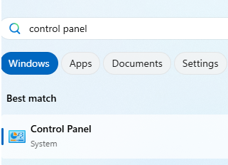
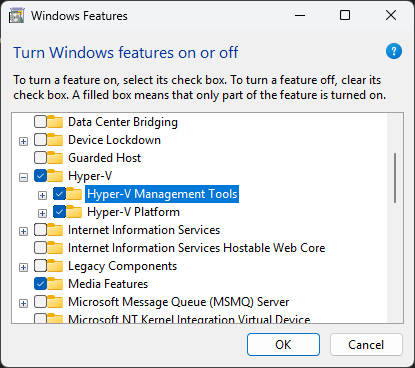
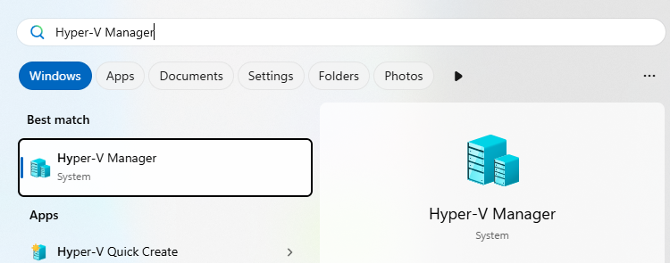
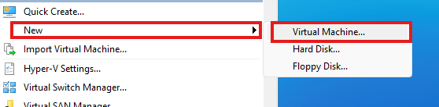
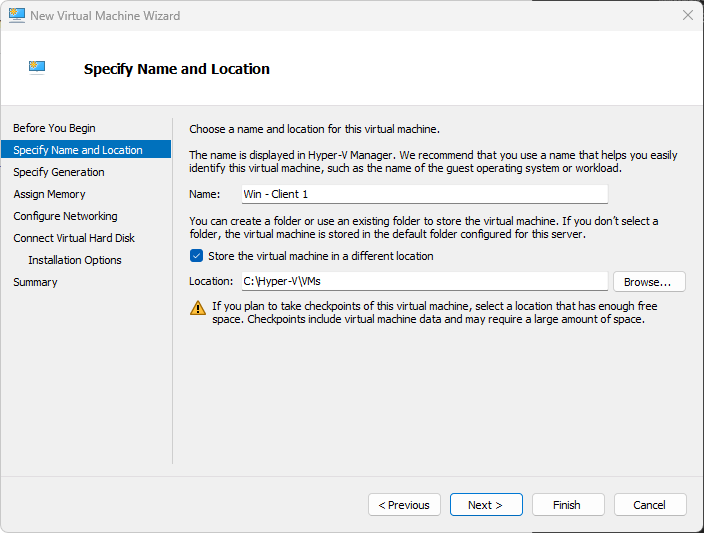
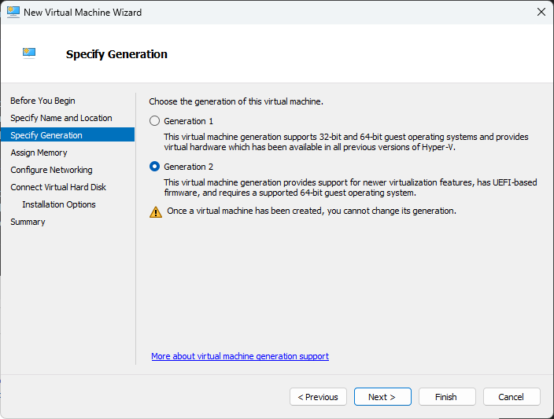
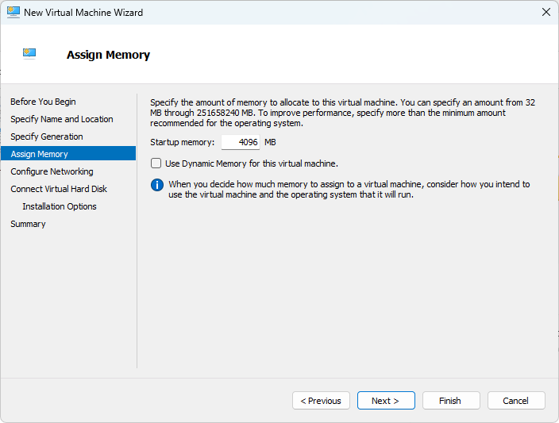
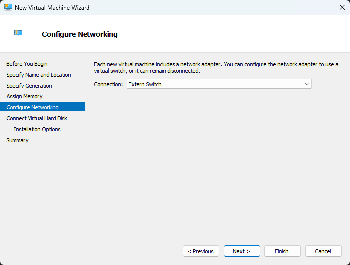

<h1 align="center"><b>Creating a Virtual Machine using Hyper-V</b> </h1> 

This guide walks you through the steps to create a virtual machine using **Hyper-V** on Windows. Hyper-V is a native hypervisor built into Windows that allows you to run virtual machines (VMs) on your system.

## Step 1: Enable Hyper-V

1. Open 
    - **Control Panel**: Press Windows key, type "Control Panel", and open it.

    

    - **Programs**: Click on "Programs"

    

    - **Turn Windows features on or off**

    
2. Check the following options:
   - Hyper-V
   - Hyper-V Management Tools
   - Hyper-V Platform

 

3. Click **OK** and restart your computer if prompted.

Alternatively, you can enable Hyper-V via PowerShell (run as administrator):

```powershell
Enable-WindowsOptionalFeature -Online -FeatureName Microsoft-Hyper-V -All
```
## Step 2: Open Hyper-V Manager

Press Windows key, type "Hyper-V Manager", and open it.



On the right-hand pane, click New → Virtual Machine.



## Step 3: Create a New Virtual Machine

1. Specify Name and Location:
    - Enter a name for your VM.
    - Optionally choose a custom location to store VM files. In my Case Im using "C:\Hyper-V\VMs"



2. Specify Generation:
    - Choose Generation 1 (for legacy BIOS) or Generation 2 (UEFI support).
For modern Operation Systems use Generation 2 so you can have support for security boot and more.



3. Assign Memory:

    - Allocate startup RAM (e.g., 2048 MB, 4.096 MB for Windows 11).  
    - Optionally enable Dynamic Memory. I will enable it after so i can edit the max and min memory.



4. Configure Networking:

   - Select a virtual switch (create one if needed under Virtual Switch Manager)



5. Connect Virtual Hard Disk:

    - Create a new Virtual Hard Disk (min 64GB for Windows ) or use an existing one

You can add a existing  Virtual Hard Disk here or just skip it.


> [!NOTE]
> The Virtual Disk is dynamic, that means it wont use 64GB directly its more like a border, the maximal size it can be. Make sure your VMs dont exide the capacity of your Drive!

6. Installation Options:

   - Choose to install an OS from an ISO file, bootable CD/DVD, or network.


> [!NOTE]
> you can download windows iso for testing from microsoft in the legal way.
> you will get a legaly coppy of windows, windows server for 180 days and windows 10-11 for 90 days.
> <a href="https://info.microsoft.com/ww-landing-windows-server-2022.html"><b> Windows Server 2022</b></a> 
> <a href="https://info.microsoft.com/ww-landing-evaluate-windows-server-2025.html"><b> Windows Server 2025</b></a> 
> <a href="https://info.microsoft.com/ww-landing-windows-10-enterprise.html"><b> Windows 10</b></a> 
> <a href="https://info.microsoft.com/ww-landing-windows-11-enterprise.html"><b> Windows 11</b></a> 

7. Click Finish to create the VM.

## Step 4: Start and Install the Operating System

1. Right-click the VM in Hyper-V Manager → Connect

    

2. Click Start to power on the VM.


3. Proceed with OS installation as you would on a physical machine.
