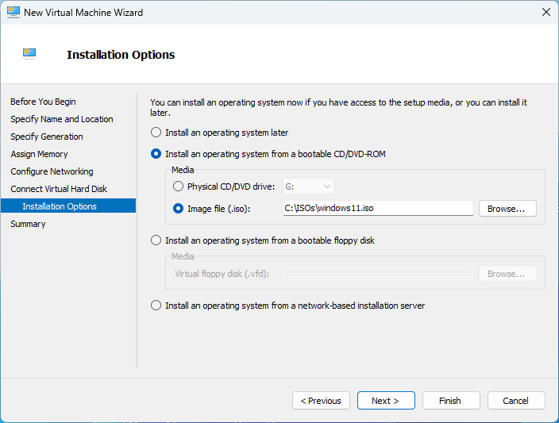
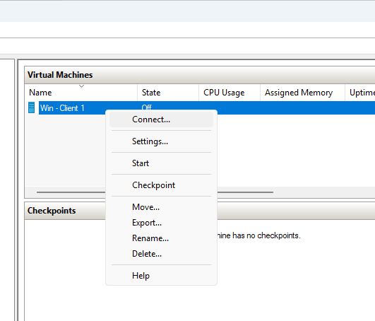
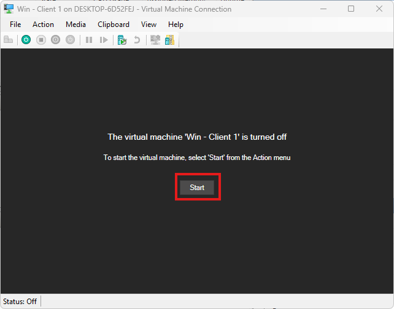

# Creating a Virtual Machine using Hyper-V

This guide walks you through the steps to create a virtual machine using **Hyper-V** on Windows. Hyper-V is a native hypervisor built into Windows that allows you to run virtual machines (VMs) on your system.

## Prerequisites

- Windows 10/11 Pro, Enterprise, or Education edition
- A processor that supports virtualization (Intel VT-x or AMD-V)
- At least 4GB of RAM (more recommended for running multiple VMs)
- Sufficient disk space for your VMs

## Step 1: Enable Hyper-V

**Option A: Using Windows Features**

1. Open **Control Panel**
   - Press the Windows key, type "Control Panel", and open it

   

2. Navigate to **Programs**

   

3. Click **Turn Windows features on or off**

   

4. Check the following options:
   - Hyper-V
   - Hyper-V Management Tools
   - Hyper-V Platform

   

5. Click **OK** and restart your computer when prompted

**Option B: Using PowerShell (Administrator)**

Run this command in PowerShell with administrator privileges:

```powershell
Enable-WindowsOptionalFeature -Online -FeatureName Microsoft-Hyper-V -All
```

## Step 2: Open Hyper-V Manager

1. Press the Windows key, type "Hyper-V Manager", and open it

   

2. In the right-hand pane, click **New → Virtual Machine**

   

## Step 3: Create a New Virtual Machine

### 1. Specify Name and Location
- Enter a descriptive name for your VM
- Choose a storage location (recommended: create a dedicated folder like "C:\Hyper-V\VMs")


### 2. Choose VM Generation
- **Generation 1**: Legacy BIOS-based (compatible with older OSes)
- **Generation 2**: UEFI-based with modern features (recommended for Windows 10/11, Server 2019+)
  - Supports Secure Boot and other security features


### 3. Assign Memory
- Recommended minimum:
  - 2GB (2048 MB) for basic VMs
  - 4GB (4096 MB) for Windows 11
- **Dynamic Memory**: Enable to allow Hyper-V to adjust memory usage automatically
  - Can be configured after VM creation with min/max values


### 4. Configure Networking
- Select a virtual switch
- If none exists, click **Virtual Switch Manager** to create one:
  - **External**: Connects to physical network (internet access)
  - **Internal**: Communication between host and VMs
  - **Private**: Communication between VMs only


### 5. Create Virtual Hard Disk
- Specify size (minimum recommendations):
  - 64GB for Windows 10/11
  - 32GB for most Linux distributions
- The disk is dynamic by default (only uses actual space needed, up to maximum)


> **Note:** The Virtual Disk is dynamic, meaning it won't use the full allocated space immediately. It will grow as needed up to the specified maximum. Make sure your VMs don't exceed the capacity of your drive!

### 6. Installation Options
- Choose one:
  - Install from ISO file (most common)
  - Install from physical media
  - Install from network
  - Install OS later



> **Note:** You can download legal evaluation copies of Windows directly from Microsoft:
> - [Windows Server 2022](https://info.microsoft.com/ww-landing-windows-server-2022.html) (180-day evaluation)
> - [Windows Server 2025](https://info.microsoft.com/ww-landing-evaluate-windows-server-2025.html) (180-day evaluation)
> - [Windows 10 Enterprise](https://info.microsoft.com/ww-landing-windows-10-enterprise.html) (90-day evaluation)
> - [Windows 11 Enterprise](https://info.microsoft.com/ww-landing-windows-11-enterprise.html) (90-day evaluation)

### 7. Review Settings and Finish
- Review your VM configuration
- Click **Finish** to create the VM

## Step 4: Start and Configure Your VM

1. **Connect to the VM**
   - Right-click the VM in Hyper-V Manager and select **Connect**
   - A new window will open showing the VM console

   

2. **Start the VM**
   - Click the **Start** button in the VM connection window

   

3. **Install the Operating System**
   - Follow the installation prompts for your chosen OS
   - The experience will be similar to installing on physical hardware

## Step 5: Post-Installation Configuration (Optional)

1. **Install Hyper-V Integration Services**
   - Improves performance and enables features like clipboard sharing
   - Usually installed automatically on Windows, may need manual installation on Linux

2. **Configure Additional Hardware**
   - Add more virtual hard disks if needed
   - Adjust CPU cores (Settings → Processor)
   - Configure advanced memory settings

3. **Create Checkpoints (Snapshots)**
   - Allows you to save VM state and roll back if needed
   - Right-click VM → Checkpoint

## Troubleshooting Tips

- **VM won't start**: Ensure virtualization is enabled in BIOS/UEFI
- **Network issues**: Check virtual switch configuration
- **Performance problems**: Adjust memory and processor allocation

---

*For more information, visit the [Microsoft Hyper-V documentation](https://docs.microsoft.com/en-us/virtualization/hyper-v-on-windows/).*