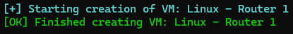
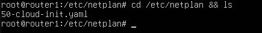
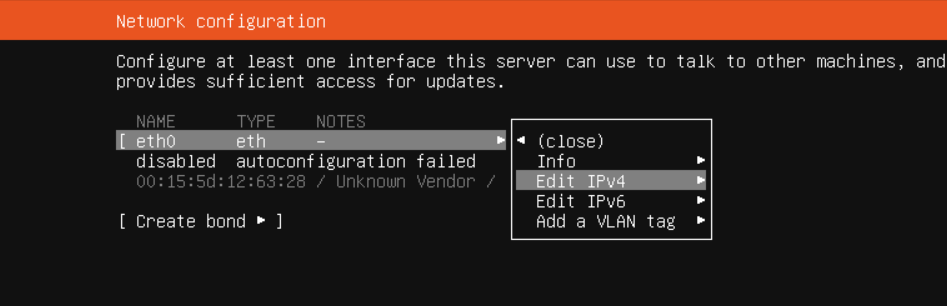
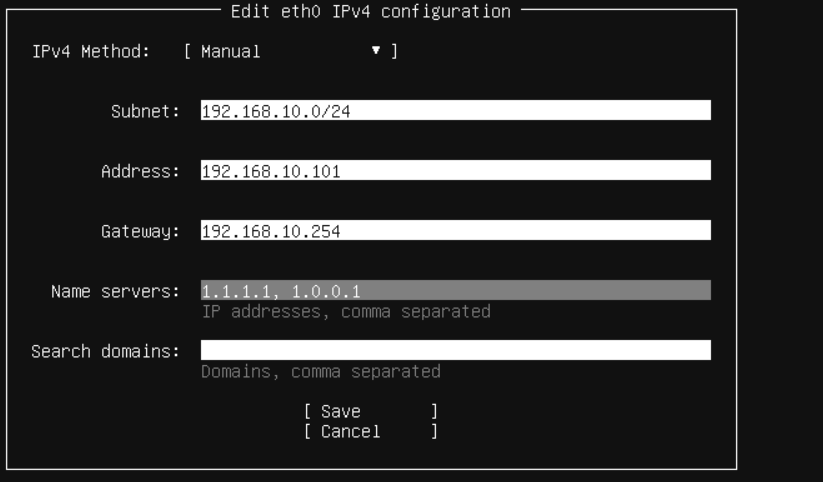

# Project InfraCore

## Linux Active Directory Lab with DNS, DHCP, Mail, and Nextcloud

This project provides a fully functional Linux-based lab environment that simulates a small enterprise network with multiple subnets, Active Directory (Samba), DNS routing, DHCP, a mail server, and Nextcloud integration.

<p align="center">
  <a href="#overview">Overview</a> •
  <a href="#hyper-v-setup">Hyper-V Setup</a> •
  <a href="#router-setup">Router Setup</a> •
  <a href="#ad-dns-servers-setup">AD/DNS Servers Setup</a>
</p>

---

<div align="center">
  <h2 id="overview">Overview</h2>
</div>

<p align="center">
  <a href="#network-structure">Network Structure</a> •
  <a href="#components">Components</a> •
  <a href="#technologies-used">Technologies Used</a> •
  <a href="#system-requirements">System Requirements</a>
</p>
Project InfraCore provides a comprehensive lab environment for learning and testing enterprise network configurations. The setup includes multiple interconnected subnets, domain controllers, and various network services to simulate a real-world corporate environment.

The domain I'm using is `smoke-break.lan`. It's an inside joke among my classmates.

<h4 id="network-structure">Network Structure</h4>

| Network       | Description              | Subnet            | Router Interface IP |
|---------------|--------------------------|-------------------|---------------------|
| Private 1     | Building 1 Clients       | 192.168.10.0/24   | 192.168.10.254      |
| Private 2     | Interbuilding (Bridge)   | 172.16.0.0/16     | 172.16.0.1, 172.16.0.2|
| Private 3     | Building 2 Clients       | 192.168.20.0/24   | 192.168.20.254      |
| WAN           | Internet Access          | DHCP or Static    | Depends on Host     |

<h4 id="components">Components</h4>

- **2 Router VMs** with IP forwarding and NAT
- **2 AD/DNS Servers** (`samba` + `bind9`)
- **1 DHCP Server** *(Setup guide to be added)*
- **1 Mail Server** *(Setup guide to be added)*
- **1 Nextcloud Server** *(Setup guide to be added)*
- **2 Client VMs** (join AD, test services)

<h4 id="technologies-used">Technologies Used</h4>

- Ubuntu Server 24.04 LTS
- Samba (Active Directory domain controller)
- Bind9 (DNS)
- `iptables` (NAT/routing)
- Nextcloud (self-hosted cloud platform)
- Netplan (for IP management)
- Hyper-V (Virtualization platform example)

<h4 id="system-requirements">System Requirements (HOST)</h4>

- **Minimum**: 4 CPU cores, 16 GB RAM
- **Recommended**: 8+ CPU cores, 32+ GB RAM
- **Storage**: At least 250 GB free space
- **Virtualization software**: VirtualBox, VMware, or Hyper-V
- **Hardware virtualization**: Virtualization must be enabled in BIOS/UEFI settings (Intel VT-x/AMD-V)

> [!CAUTION]
> Before installing any virtualization software, ensure that hardware virtualization is enabled in your system's BIOS/UEFI settings. This is typically found under CPU settings as "Virtualization Technology," "VT-x," "AMD-V," or similar.

---

<div align="center">
  <h2 id="hyper-v-setup">Hyper-V Setup</h2>
</div>

This guide explains how to configure the virtual machines for the lab environment. In this example, we're using Windows 11 Pro with Hyper-V.

### Enable Hyper-V (Windows Host only)

Before creating VMs, you need to enable Hyper-V on your Windows system:

**Using PowerShell (Administrator)**

Run this command in PowerShell with administrator privileges:

```powershell
Enable-WindowsOptionalFeature -Online -FeatureName Microsoft-Hyper-V -All
```
Reboot your system if prompted.

If you're looking for a detailed, step-by-step tutorial on how to set up a VM manually, [click here](Hyper-VSetup.md).

For faster deployment, you can use our PowerShell script to automatically create all 9 VMs.

### Automated VM Creation

You can download the script directly to your user directory using PowerShell, or manually from the GitHub repository:

```powershell
# Download the script
Invoke-WebRequest -Uri "https://raw.githubusercontent.com/fIyingPhoenix/InfraCore/main/VM-Create.ps1" -OutFile "$HOME/VM-Create.ps1"
```

### Configure the Script

After downloading the script, edit it with Notepad or your preferred text editor:

```powershell
# Edit the file
notepad.exe "$HOME/VM-Create.ps1"
```

#### Required Modifications:

1.  **ISO Paths**: Update with the correct paths to your ISO files:
    *   `$ISO_Client` - Path to client OS ISO (Windows)
    *   `$ISO_Server` - Path to server OS ISO (Ubuntu)

2.  **Memory Allocation**:
    *   `$MemoryMinimumBytes` - Minimum allocated memory
    *   `$MemoryMaximumBytes` - Maximum allocated memory
    *   `$MemoryStartupBytes` - Initial memory at VM startup

3.  **Storage Locations**:
    *   `$VMPath` - Location for VM runtime state files
    *   `$VHDPath` - Location for virtual hard disks

### Run the Script

Once configured, run the script to create all VMs:

```powershell
# Navigate to the directory and run the script
cd $HOME
.\VM-Create.ps1 -Install

# To remove the VMs and associated resources
cd $HOME; .\VM-Create.ps1 -Uninstall
```



> [!TIP]
> Make sure to check the boot order for each VM after creation. For Windows 11 VMs, increase the RAM to at least 4GB and use 2 Cores to meet minimum requirements.

## Initial VM Setup

Start the VMs and install the operating systems. If you need guidance, you can find it here:
- [Ubuntu Installation Guide](UbuntuServerInstall.md) 
- [Windows Installation Guide](WindowsClientInstall.md) *(Setup guide to be added)*

> [!CAUTION]
> Install the first two Router VMs first. Initially, assign just one NIC (connected to your WAN/Internet switch) to each router VM. The other VMs will be installed *after* the routers are configured, as they will need internet access (via the configured routers) for OS installation and updates.

<div align="center">
  <h2 id="router-setup">Router Setup</h2>
</div>

I assume you've installed Ubuntu Server (Minimal) and configured a static IP for the main router (Router 1) on its WAN interface during installation. This guide will help you set up two Ubuntu 24.04 LTS-based routers with three NICs each. We'll configure Router 1 as the main gateway and Router 2 as a sub-router connected via an internal network.

<p align="center">
  <a href="#router-1-configuration">Router 1 Configuration</a> •
  <a href="#router-2-configuration">Router 2 Configuration</a>
</p>

<h3 id="router-1-configuration">Router 1 Configuration</h3>

Router 1 will connect to the WAN, Private 1 (Building 1), and Private 2 (Interbuilding).

### Prepare the System (Router 1)

```bash
# Update system and install necessary packages
sudo apt update && sudo apt upgrade -y
sudo apt install -y nano netfilter-persistent iputils-ping iptables
sudo reboot # Important for kernel updates if any

# Set hostname (use your actual domain)
sudo hostnamectl set-hostname router1.smoke-break.lan
echo "127.0.0.1 localhost" | sudo tee /etc/hosts
echo "127.0.1.1 router1.smoke-break.lan router1" | sudo tee -a /etc/hosts
```

### Adding Network Interfaces (Router 1)

Assuming Router 1 VM initially has one NIC for WAN. Add two more NICs in Hyper-V:
1.  NIC 2: Connected to `PrivateSwitch 1` (for Building 1 Clients)
2.  NIC 3: Connected to `PrivateSwitch 2` (for Interbuilding Bridge)

Or use PowerShell:
```powershell
# Ensure VMName and SwitchName variables match your setup from VM-Create.ps1 or manual config
# Add-VMNetworkAdapter -VMName "Linux - Router 1" -SwitchName "Default Switch" # Assuming this is your WAN
Add-VMNetworkAdapter -VMName "Linux - Router 1" -SwitchName "PrivateSwitch 1"
Add-VMNetworkAdapter -VMName "Linux - Router 1" -SwitchName "PrivateSwitch 2"
```

### Verify Network Interfaces (Router 1)

Check if Ubuntu detected the new NICs:
```bash
ip a
```
You should see interfaces like `lo`, `eth0` (WAN), `eth1` (PrivateSwitch 1), `eth2` (PrivateSwitch 2). Names (`ethX`) may vary. Identify them carefully.

 

- `lo`: loopback
- `eth0`: WAN (e.g., connected to Hyper-V "Default Switch" or an External switch for internet)
- `eth1`: PrivateSwitch 1 (Building 1 LAN)
- `eth2`: PrivateSwitch 2 (Interbuilding LAN)

### Configure Netplan (Router 1)

Navigate to netplan config:
```bash
cd /etc/netplan && ls
```
Identify your YAML file (e.g., `00-installer-config.yaml` or `50-cloud-init.yaml`).
 

Create a backup:
```bash
sudo cp 50-cloud-init.yaml 50-cloud-init.yaml.bak # Using .yaml.bak as a more standard extension
```
Edit the config file:
```bash
sudo nano 50-cloud-init.yaml
```
Adapt this example (replace interface names `ethX` if yours are different):
```yaml
network:
  version: 2
  renderer: networkd
  ethernets:
    eth0: # WAN interface
      dhcp4: true # Or use DHCP if your WAN provides it
      nameservers:
        addresses: [1.1.1.1, 1.0.0.1] # Cloudflare DNS, good choice
    eth1: # Building 1 clients (PrivateSwitch 1)
      addresses:
        - 192.168.10.254/24
    eth2: # Bridge to Router 2 (PrivateSwitch 2)
      addresses:
        - 172.16.0.1/16
      routes:
        - to: 192.168.20.0/24 # Route to Building 2 network
          via: 172.16.0.2    # via Router 2's interbuilding interface
```
*Self-correction: The original YAML for `eth0` had a static IP. If the WAN connection on `eth0` is from your home router or another DHCP source, `dhcp4: true` is simpler. If it MUST be static, ensure `gateway4` is set under `eth0` and remove `routes: - to: default - via: ...` as `gateway4` handles the default route.*
If using static WAN IP for `eth0`:
```yaml
# ...
    eth0: # WAN interface
      addresses:
        - 10.100.18.19/24
      routes:
        - to: default # Make sure you use your WAN IP
          via: 10.100.18.254 # Route to the WAN connection (default gateway of your WAN connection
      nameservers:
        addresses: [1.1.1.1, 1.0.0.1]
# ...
```

Test and apply:
```bash
sudo netplan try
sudo netplan apply
```
> [!TIP]
> If you encounter an error, carefully check spacing and syntax in the YAML file.

### Enable IP Forwarding (Router 1)
```bash
echo "net.ipv4.ip_forward=1" | sudo tee /etc/sysctl.d/99-ipforward.conf
sudo sysctl -p /etc/sysctl.d/99-ipforward.conf
```

### Set Up NAT (Router 1)
Ensure `eth0` is your WAN interface.
```bash
sudo iptables -t nat -A POSTROUTING -o eth0 -j MASQUERADE
```

### Make `iptables` Rules Persistent (Router 1)
```bash
sudo netfilter-persistent save
```

<h3 id="router-2-configuration">Router 2 Configuration</h3>

Router 2 connects Private 2 (Interbuilding) and Private 3 (Building 2).

### Prepare the System (Router 2)
```bash
# Update system and install necessary packages
sudo apt update && sudo apt upgrade -y
sudo apt install -y nano netfilter-persistent iputils-ping iptables
sudo reboot

# Set hostname
sudo hostnamectl set-hostname router2.smoke-break.lan
echo "127.0.0.1 localhost" | sudo tee /etc/hosts
echo "127.0.1.1 router2.smoke-break.lan router2" | sudo tee -a /etc/hosts
```

### Network Interfaces for Router 2
Router 2 VM initially has one NIC.
1.  Change its connection from WAN/Default Switch to `PrivateSwitch 2` (Interbuilding).
2.  Add a new NIC and connect it to `PrivateSwitch 3` (for Building 2 Clients).

Using PowerShell:
```powershell
# Set the existing NIC of Router 2 to PrivateSwitch 2
Connect-VMNetworkAdapter -VMName "Linux - Router 2" -SwitchName "PrivateSwitch 2"
# Or, if you know the adapter name:
Connect-VMNetworkAdapter -VMName "Linux - Router 2" -Name "Network Adapter" -SwitchName "PrivateSwitch 2"

Add-VMNetworkAdapter -VMName "Linux - Router 2" -SwitchName "PrivateSwitch 3"
```
*Note: The command `Connect-VMNetworkAdapter -VMName "Linux - Router 2" -SwitchName "PrivateSwitch 2"` implies the VM already has an adapter. You might need to identify which one if there are multiple, or if it's the primary one from creation.*

### Verify Network Interfaces (Router 2)
```bash
ip a
```
You should see interfaces like `lo`, `eth0` (PrivateSwitch 2), `eth1` (PrivateSwitch 3).

### Configure Netplan (Router 2)
Backup existing netplan config:
```bash
cd /etc/netplan && sudo cp 50-cloud-init.yaml 50-cloud-init.yaml.bak
```
Edit the config file:
```bash
sudo nano 50-cloud-init.yaml
```
Adapt this example:
```yaml
network:
  version: 2
  renderer: networkd
  ethernets:
    eth0: # Interbuilding interface (PrivateSwitch 2)
      addresses:
        - 172.16.0.2/16
      routes:
        - to: default
          via: 172.16.0.1 # Default gateway is Router 1
        - to: 192.168.10.0/24 # Route to Building 1 network
          via: 172.16.0.1    # via Router 1
      nameservers: # Add nameservers for Router 2 itself to resolve external names
        addresses: [1.1.1.1, 1.0.0.1] # Or your internal DNS once they are up
    eth1: # Building 2 clients (PrivateSwitch 3)
      addresses:
        - 192.168.20.254/24 # Matches network table for router interface IP
```

Test and apply:
```bash
sudo netplan try
sudo netplan apply
```

### Enable IP Forwarding and Configure Firewall (Router 2)
```bash
echo "net.ipv4.ip_forward=1" | sudo tee /etc/sysctl.d/99-ipforward.conf
sudo sysctl -p /etc/sysctl.d/99-ipforward.conf

# NAT for traffic from Building 2 (eth1) going out via Interbuilding link (eth0)
sudo iptables -t nat -A POSTROUTING -o eth0 -j MASQUERADE

# Allow forwarding from Building 2 to Interbuilding link
sudo iptables -A FORWARD -i eth1 -o eth0 -j ACCEPT
# Allow established and related traffic back
sudo iptables -A FORWARD -i eth0 -o eth1 -m state --state RELATED,ESTABLISHED -j ACCEPT
```

### Make `iptables` Rules Persistent (Router 2)
```bash
sudo netfilter-persistent save
```

## Testing Your Router Configuration
```bash
# From Router 1:
ping -c 3 172.16.0.2    # Ping Router 2's interbuilding IP
ping -c 3 192.168.20.254 # Ping Router 2's Building 2 LAN IP (via Router 2)
ping -c 3 1.1.1.1       # Ping external (Cloudflare DNS)

# From Router 2:
ping -c 3 172.16.0.1    # Ping Router 1's interbuilding IP
ping -c 3 192.168.10.254 # Ping Router 1's Building 1 LAN IP (via Router 1)
ping -c 3 1.1.1.1       # Ping external (Cloudflare DNS)
```
<div align="center">
  <h2 id="ad-dns-servers-setup">AD/DNS Servers Setup</h2>
</div>

Setting up Active Directory-like functionality on Linux involves Samba as an AD DC (Domain Controller) and BIND9 for DNS. We will use `Linux - Server 1` (as Primary DC: `dns1`) and `Linux - Server 3` (as Secondary DC: `dns2`).

## Initial Setup for AD/DNS Servers

1.  **VM Network Connections**:
    *   Ensure `Linux - Server 1` VM is connected to `PrivateSwitch 1`.
    *   Ensure `Linux - Server 3` VM is connected to `PrivateSwitch 3`.
2.  Start the VMs and install Ubuntu Server.
3.  During Ubuntu installation network configuration:

    **Server 1 (`dns1`) Network Configuration (Static):**
    ```plaintext
    Subnet: 192.168.10.0/24
    IP Address: 192.168.10.101
    Gateway: 192.168.10.254 (Router 1 - eth1)
    DNS Servers: 1.1.1.1, 1.0.0.1 (Temporary, will be changed later)
    Search Domain: smoke-break.lan (Optional here, will be set by AD)
    ```

    **Server 3 (`dns2`) Network Configuration (Static):**
    ```plaintext
    Subnet: 192.168.20.0/24
    IP Address: 192.168.20.101
    Gateway: 192.168.20.254 (Router 2 - eth1)
    DNS Servers: 1.1.1.1, 1.0.0.1 (Temporary, will be changed later)
    Search Domain: smoke-break.lan (Optional here, will be set by AD)
    ```
    
    

    The DNS server addresses will later be changed to point to themselves and each other. After setting up networking, ensure you have internet access on both servers. Finish OS installation.

## 1. Prerequisites (on both AD/DNS servers)
```bash
# Update system and install packages
sudo apt update && sudo apt full-upgrade -y # Use full-upgrade for robustness
sudo apt install -y nano ufw iputils-ping samba krb5-user krb5-config winbind libpam-winbind libnss-winbind bind9 bind9utils dnsutils chrony
sudo reboot

# Configure NTP for time synchronization (crucial for Kerberos)
sudo systemctl start chrony
sudo systemctl enable chrony
timedatectl status
# Look for:
# System clock synchronized: yes
# NTP service: active

chronyc sources
# You should see servers listed with a '*' or '+' next to them, indicating they are being used.
```
> [!TIP]
> During `krb5-user` installation, if prompted for Kerberos realm, you can leave it blank as Samba will configure it, or enter `SMOKE-BREAK.LAN` (all caps).

## 2. Set up Primary Domain Controller (Server 1 - `dns1`)

### Configure Hostname & Hosts File (Server 1)
```bash
sudo hostnamectl set-hostname dns1.smoke-break.lan
sudo nano /etc/hosts
```
Ensure `/etc/hosts` looks like this:
```plaintext
127.0.0.1       localhost
192.168.10.101  dns1.smoke-break.lan dns1
# The following line may be added by systemd-hostnamed or similar, ensure it matches or remove if redundant with above
# 127.0.1.1       dns1.smoke-break.lan dns1
```

### Configure Samba as AD DC with BIND9_DLZ Backend (Server 1)
Stop services that might interfere:
```bash
sudo systemctl stop smbd nmbd winbind systemd-resolved
sudo systemctl disable smbd nmbd winbind systemd-resolved
```
Remove existing `/etc/resolv.conf` if it's a symlink and create a static one for provisioning:
```bash
sudo rm /etc/resolv.conf
echo "nameserver 127.0.0.1" | sudo tee /etc/resolv.conf # Temporarily point to self
# Alternatively, use an external DNS like 1.1.1.1 for the provisioning step if local DNS isn't up yet
# echo "nameserver 1.1.1.1" | sudo tee /etc/resolv.conf
```

Backup existing Samba config:
```bash
sudo mv /etc/samba/smb.conf /etc/samba/smb.conf.bak
```
Provision the domain:
```bash
sudo samba-tool domain provision --use-rfc2307 --interactive
```
Answer the prompts:
- **Realm:** `SMOKE-BREAK.LAN` (Must be ALL CAPS)
- **Domain:** `SMOKE-BREAK` (NetBIOS name, usually first part of realm, ALL CAPS)
- **Server Role:** `dc`
- **DNS backend:** `BIND9_DLZ`
- **DNS forwarder IP address (leave blank to disable):** `1.1.1.1` (Or your preferred external DNS forwarder)
- **Administrator password:** Choose a strong, secure password.

> [!TIP]
> Provisioning can take time. If it hangs for 15-20+ minutes:
> 1. `Ctrl+C` to cancel.
> 2. `ps aux | grep samba` to check for stuck processes.
> 3. `sudo pkill -f samba` if any are found.
> 4. Restore `smb.conf.bak` if necessary, ensure `/etc/resolv.conf` is correct, and retry `samba-tool domain provision ... -d 5` for debug info.
> 5. Check logs: `less /var/log/samba/log.samba`

Copy Samba's Kerberos config:
```bash
sudo cp /var/lib/samba/private/krb5.conf /etc/krb5.conf
```

### Configure BIND9 for Samba (Server 1)
Edit BIND9 configuration. The main file is usually `/etc/bind/named.conf`. Add the include for Samba's BIND9_DLZ:
```bash
sudo nano /etc/bind/named.conf.options # Often better to put Samba's specifics here or in named.conf.local
```
Add Samba's generated BIND configuration. Typically, you add this to `/etc/bind/named.conf.local` or ensure it's included by `named.conf`:
You also need to configure `named.conf.options` to allow BIND to talk to Samba, and to set forwarders if not done during provision:
```bash
sudo nano /etc/bind/named.conf.options
```
Ensure it contains (or add):
```bind
options {
    directory "/var/cache/bind";

    include "/var/lib/samba/bind-dns/named.conf"; //Samba's BIND9_DLZ 

    // If you are providing DNS for IPv6, uncomment the following lines:
    // listen-on-v6 { any; };

    tkey-gssapi-keytab "/var/lib/samba/bind-dns/dns.keytab"; // For secure DDNS

    // Forwarders if not set during samba-tool provision or if you want to change them
    forwarders {
        1.1.1.1;
        1.0.0.1;
    };
    forward only; // Or "forward first;"
    // Allow queries from your LANs
    allow-query { localhost; localnets; 192.168.10.0/24; 192.168.20.0/24; 172.16.0.0/16; };
    // Allow recursion for your clients
    allow-recursion { localhost; localnets; 192.168.10.0/24; 192.168.20.0/24; 172.16.0.0/16; };
};
```
*(The `include "/var/lib/samba/bind-dns/named.conf";` line is crucial. AppArmor fix is also important.)*

Adjust AppArmor for BIND9:
```bash
# Option 1: Set BIND to complain mode (less secure, for troubleshooting)
# sudo aa-complain /usr/sbin/named

# Option 2: Edit the AppArmor profile (recommended)
sudo nano /etc/apparmor.d/usr.sbin.named
```
Add these lines within the profile, usually before the final `}`:
```
  # Samba BIND9_DLZ requirements
  /var/lib/samba/private/dns/** rwk,
  /var/lib/samba/bind-dns/** rwk,
  /var/lib/samba/bind-dns/dns.keytab rk,
```
Then reload AppArmor profile:
```bash
sudo apparmor_parser -r /etc/apparmor.d/usr.sbin.named
```

Finalize `/etc/resolv.conf` for the DC itself:
```bash
sudo rm /etc/resolv.conf
echo "nameserver 127.0.0.1" | sudo tee /etc/resolv.conf
echo "search smoke-break.lan" | sudo tee -a /etc/resolv.conf
sudo chattr +i /etc/resolv.conf # Make immutable to prevent overwrites by DHCP clients etc.
```

Start and enable services:
```bash
sudo systemctl unmask samba-ad-dc # If it was masked
sudo systemctl start samba-ad-dc bind9
sudo systemctl enable samba-ad-dc bind9
# sudo systemctl status samba-ad-dc bind9 # Check status
```
Reboot for good measure:
```bash
sudo reboot
```

Test DNS functionality (after reboot):
```bash
host -t SRV _ldap._tcp.smoke-break.lan. # Note trailing dot for FQDN
host -t SRV _kerberos._udp.smoke-break.lan.
host -t A dns1.smoke-break.lan.
kinit administrator # Test Kerberos, enter admin password
klist # Should show ticket
```
Expected output similar to:
```
_ldap._tcp.smoke-break.lan has SRV record 0 100 389 dns1.smoke-break.lan.
_kerberos._udp.smoke-break.lan has SRV record 0 100 88 dns1.smoke-break.lan.
dns1.smoke-break.lan has address 192.168.10.101
```

### Configure the Firewall (Server 1 - `dns1`)
```bash
sudo ufw allow 53/tcp         # DNS
sudo ufw allow 53/udp         # DNS
sudo ufw allow 88/tcp         # Kerberos
sudo ufw allow 88/udp         # Kerberos
sudo ufw allow 135/tcp        # RPC Endpoint Mapper
sudo ufw allow 137/udp        # NetBIOS Name Service
sudo ufw allow 138/udp        # NetBIOS Datagram Service
sudo ufw allow 139/tcp        # NetBIOS Session Service (SMB over NetBIOS)
sudo ufw allow 389/tcp        # LDAP
sudo ufw allow 389/udp        # LDAP CLDAP
sudo ufw allow 445/tcp        # SMB/CIFS (Direct Host)
sudo ufw allow 464/tcp        # Kerberos kpasswd
sudo ufw allow 464/udp        # Kerberos kpasswd
sudo ufw allow 636/tcp        # LDAPS
sudo ufw allow 3268/tcp       # Global Catalog
sudo ufw allow 3269/tcp       # Global Catalog Secure
sudo ufw allow 49152:65535/tcp # RPC Dynamic Ports for AD Replication, etc.
sudo ufw enable
sudo ufw status verbose
```

## 3. Set up Secondary Domain Controller (Server 3 - `dns2`)

### Configure Hostname & Hosts File (Server 3)
```bash
sudo hostnamectl set-hostname dns2.smoke-break.lan
sudo nano /etc/hosts
```
Ensure `/etc/hosts` looks like this:
```plaintext
127.0.0.1       localhost
192.168.20.101  dns2.smoke-break.lan dns2
# The following line may be added by systemd-hostnamed or similar, ensure it matches or remove if redundant with above
# 127.0.1.1       dns2.smoke-break.lan dns2
```

### Join the Domain (Server 3)
Stop potentially interfering services:
```bash
sudo systemctl stop smbd nmbd winbind systemd-resolved
sudo systemctl disable smbd nmbd winbind systemd-resolved
```
Configure `/etc/resolv.conf` to point to the Primary DC (`dns1`) for the join process:
```bash
sudo rm /etc/resolv.conf
echo "nameserver 192.168.10.101" | sudo tee /etc/resolv.conf # Point to dns1
echo "search smoke-break.lan" | sudo tee -a /etc/resolv.conf
```
Backup existing Samba config:
```bash
sudo mv /etc/samba/smb.conf /etc/samba/smb.conf.bak # If it exists
```
Join the domain as a DC:
```bash
sudo samba-tool domain join smoke-break.lan DC -U"SMOKE-BREAK\administrator" --dns-backend=BIND9_DLZ
# Or: sudo samba-tool domain join smoke-break.lan DC --username=administrator --dns-backend=BIND9_DLZ
```
Enter the Administrator password when prompted.

Copy Samba's Kerberos config (should be replicated, but good to ensure):
```bash
sudo cp /var/lib/samba/private/krb5.conf /etc/krb5.conf
```

### Configure BIND9 (Server 3)
Same BIND9 configuration steps as for Server 1 regarding `named.conf.local` (or `named.conf`) and `named.conf.options`.
```bash
sudo nano /etc/bind/named.conf.local # Or your main named.conf or included file
```
Add: `include "/var/lib/samba/bind-dns/named.conf";`

```bash
sudo nano /etc/bind/named.conf.options
```
Ensure `tkey-gssapi-keytab "/var/lib/samba/bind-dns/dns.keytab";` is present.
Forwarders should also be set (e.g., `1.1.1.1`, `1.0.0.1`).
Also add `allow-query` and `allow-recursion` as on `dns1`.

Adjust AppArmor as on Server 1.
```bash
sudo nano /etc/apparmor.d/usr.sbin.named # Add same paths
sudo apparmor_parser -r /etc/apparmor.d/usr.sbin.named
```

Finalize `/etc/resolv.conf` for `dns2`:
```bash
sudo rm /etc/resolv.conf
echo "nameserver 127.0.0.1" | sudo tee /etc/resolv.conf       # Primary: itself
echo "nameserver 192.168.10.101" | sudo tee -a /etc/resolv.conf # Secondary: dns1
echo "search smoke-break.lan" | sudo tee -a /etc/resolv.conf
sudo chattr +i /etc/resolv.conf
```

Start and enable services:
```bash
sudo systemctl unmask samba-ad-dc
sudo systemctl start samba-ad-dc bind9
sudo systemctl enable samba-ad-dc bind9
```
Reboot:
```bash
sudo reboot
```

### Test Secondary DC (Server 3 - `dns2`)
After reboot:
```bash
host -t SRV _ldap._tcp.smoke-break.lan. # Should now show both dns1 and dns2
host -t A dns2.smoke-break.lan.
kinit administrator
klist
```
On `dns1`, also test `host -t SRV _ldap._tcp.smoke-break.lan.` to see if `dns2` is listed.
Check replication:
```bash
sudo samba-tool drs showrepl
```

### Configure Firewall (Server 3 - `dns2`)
Apply the same `ufw` rules as for Server 1.

## 4. Client Configuration & Joining Domain

Install the Windows client VMs (`Win - Client 1` and `Win - Client 2`):
- `Win - Client 1` connected to `PrivateSwitch 1`.
- `Win - Client 2` connected to `PrivateSwitch 3`. 

Configure static IP addresses on Windows clients:

**Client 1 (on `PrivateSwitch 1`):**
- IP Address: `192.168.10.50`
- Netmask: `255.255.255.0` (or `/24`)
- Gateway: `192.168.10.254` (Router 1)
- **Primary DNS:** `192.168.10.101` (`dns1`)
- **Secondary DNS:** `192.168.20.101` (`dns2`)

**Client 2 (on `PrivateSwitch 3`):**
- IP Address: `192.168.20.50`
- Netmask: `255.255.255.0` (or `/24`)
- Gateway: `192.168.20.254` (Router 2)
- **Primary DNS:** `192.168.20.101` (`dns2`)
- **Secondary DNS:** `192.168.10.101` (`dns1`)

### Joining Windows Clients to `smoke-break.lan` Domain
1.  On a Windows client, open System Properties (`sysdm.cpl`).
2.  Click "Change..." under Computer Name tab.
3.  Under "Member of", select "Domain:" and type `smoke-break.lan`.
4.  Click OK. You'll be prompted for credentials. Use `SMOKE-BREAK\administrator` and the password you set during Samba provision.
5.  If successful, you'll be welcomed to the domain and prompted to restart.

## Troubleshooting AD/DNS
If you encounter issues:
1.  **Time Synchronization:** Ensure NTP is working on all DCs and clients. `timedatectl status`. Kerberos is very sensitive to time differences.
2.  **Service Status:**
    ```bash
    sudo systemctl status samba-ad-dc bind9 ntp # Check ntp too
    journalctl -xeu samba-ad-dc # Detailed logs for samba
    journalctl -xeu bind9       # Detailed logs for bind9
    ```
3.  **Samba Logs:**
    ```bash
    sudo tail -f /var/log/samba/log.samba # General samba log
    # Samba keeps logs per process, explore /var/log/samba/ for more details
    ```
4.  **BIND9 Logs:** Often in `/var/log/syslog` or `/var/log/messages` if not configured for a separate file. Check `named.conf` for log file locations.
    ```bash
    sudo tail -f /var/log/syslog | grep named
    ```
5.  **Connectivity & DNS Resolution:**
    ```bash
    ping dns1.smoke-break.lan
    ping dns2.smoke-break.lan
    nslookup smoke-break.lan # Should return IPs of both DCs
    nslookup -type=SRV _ldap._tcp.smoke-break.lan # Check SRV records
    ```
6.  **Samba Domain/Replication Info:**
    ```bash
    sudo samba-tool domain info SMOKE-BREAK.LAN # Use REALM
    sudo samba-tool drs showrepl # Check replication status between DCs
    sudo samba-tool dns query <primary_dc_hostname> <your_domain_REALM> @ ALL # Query all DNS records
    ```
7.  **AppArmor:** If BIND9 fails to load zones or write to log files, check AppArmor:
    ```bash
    sudo dmesg | grep DENIED | grep named
    # Or check /var/log/audit/audit.log if auditd is installed
    ```
    If you see AppArmor denials, refine the profile in `/etc/apparmor.d/usr.sbin.named` and reload.
