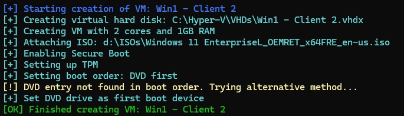

# Project InfraCore

## Linux Active Directory Lab with DNS, DHCP, Mail, and Nextcloud

This project provides a fully functional Linux-based lab environment that simulates a small enterprise network with multiple subnets, Active Directory (Samba), DNS routing, DHCP, a mail server, and Nextcloud integration.

<p align="center">
  <a href="#overview">Overview</a> •
  <a href="#hyper-v-setup">Hyper-V Setup</a> •
  <a href="#router-setup">Router Setup</a> •
  <a href="#ad-dns-servers-setup">AD/DNS Servers Setup</a> •
  <a href="#dhcp-server-setup">DHCP Server Setup</a> •
  <a href="#windows-clients-setup">Windows Clients AD join</a>
</p>

---

<div align="center">
  <h2 id="overview">Overview</h2>
</div>

<p align="center">
  <a href="#network-structure">Network Structure</a> •
  <a href="#components">Components</a> •
  <a href="#technologies-used">Technologies Used</a> •
  <a href="#system-requirements">System Requirements</a>
</p>
Project InfraCore provides a comprehensive lab environment for learning and testing enterprise network configurations. The setup includes multiple interconnected subnets, domain controllers, and various network services to simulate a real-world corporate environment.

The domain I'm using is `smoke-break.lan`. It's an inside joke among my classmates.

<h4 id="network-structure">Network Structure</h4>

| Network | Description | Subnet | Router Interface IP |
| :--- | :--- | :--- | :--- |
| Private 1 | Building 1 Clients | 192.168.10.0/24 | 192.168.10.254 |
| Private 2 | Interbuilding (Bridge) | 172.16.0.0/16 | 172.16.0.1, 172.16.0.2 |
| Private 3 | Building 2 Clients | 192.168.20.0/24 | 192.168.20.254 |
| WAN | Internet Access | DHCP or Static | Depends on Host |

<details align="center">
  <summary>
  <h3>Visual Example</h3>
  </summary>
  
</details>

<h4 id="components">Components</h4>

*   **2 Router VMs** with IP forwarding and NAT
*   **2 AD/DNS Servers** (`samba`)
*   **1 DHCP Server**
*   **1 Mail Server** *(Setup guide to be added)*
*   **1 Nextcloud Server** *(Setup guide to be added)*
*   **2 Client VMs** 

<h4 id="technologies-used">Technologies Used</h4>

*   Ubuntu Server 24.04 LTS
*   Samba (Active Directory domain controller)
*   `iptables` (NAT/routing)
*   Netplan (for IP management)
*   Hyper-V (Virtualization platform example)

<h4 id="system-requirements">System Requirements (HOST)</h4>

*   **Minimum**: 4 CPU cores, 16 GB RAM
*   **Recommended**: 8+ CPU cores, 32+ GB RAM
*   **Storage**: At least 250 GB free space
*   **Virtualization software**: VirtualBox, VMware, or Hyper-V
*   **Hardware virtualization**: Virtualization must be enabled in BIOS/UEFI settings (Intel VT-x/AMD-V)

> [!CAUTION]
> Before installing any virtualization software, ensure that hardware virtualization is enabled in your system's BIOS/UEFI settings. This is typically found under CPU settings as "Virtualization Technology," "VT-x," "AMD-V," or similar.

---

<div align="center">
  <h2 id="hyper-v-setup">Hyper-V Setup</h2>
</div>

This guide explains how to configure the virtual machines for the lab environment. In this example, we're using Windows 11 Pro with Hyper-V.

### 1. Enable Hyper-V (Windows Host)

Before creating VMs, enable Hyper-V by running this command in an **Administrator PowerShell** session. Reboot your system if prompted.

```powershell
Enable-WindowsOptionalFeature -Online -FeatureName Microsoft-Hyper-V -All
```

> [!NOTE]
> If you prefer a manual, step-by-step tutorial on creating a VM, [click here](Hyper-VSetup.md).

### 2. Automated VM Creation Script

For faster deployment, use the provided PowerShell script to create all 9 VMs automatically.

First, download the script to your user directory:

```powershell
# Download the script
$scriptUrl = "https://raw.githubusercontent.com/fIyingPhoenix/InfraCore/main/VM-Create.ps1"
$outputPath = "$HOME/VM-Create.ps1"
Invoke-WebRequest -Uri $scriptUrl -OutFile $outputPath
```

Next, open the script in a text editor to configure it for your system.

```powershell
# Edit the file
notepad.exe $outputPath
```

**Required Modifications:**

1.  **ISO Paths**: Update `$ISO_Client` and `$ISO_Server` with the full paths to your Windows and Ubuntu ISO files.
2.  **Memory Allocation**: Adjust `$MemoryMinimumBytes`, `$MemoryMaximumBytes`, and `$MemoryStartupBytes` as needed for your system.
3.  **Storage Locations**: Set `$VMPath` (for VM state files) and `$VHDPath` (for virtual hard disks) to your desired locations.

### 3. Run the Script

Once configured, run the script from an **Administrator PowerShell** session to create or remove the lab environment.

```powershell
# Navigate to the directory where the script was saved
cd $HOME

# To CREATE all VMs and virtual switches
.\VM-Create.ps1 -Install

# To REMOVE all VMs and associated resources
.\VM-Create.ps1 -Uninstall
```



> [!TIP]
> After creation, check the boot order for each VM. For the Windows 11 clients, ensure they have at least 4GB of RAM and 2 vCPUs to meet minimum system requirements.

### 4. Initial VM Setup

Start the VMs and install their operating systems.

*   [Ubuntu Installation Guide](UbuntuServerInstall.md) *(Setup guide to be added)*
*   [Windows Installation Guide](WindowsClientInstall.md) *(Setup guide to be added)*

> [!CAUTION]
> **Install the two Router VMs first.** Initially, each router VM should only have one network adapter connected to your WAN/Internet switch (e.g., "Default Switch"). The other VMs will be installed *after* the routers are fully configured, as they will rely on the routers for internet access during their own OS installation.

---

<div align="center">
  <h2 id="router-setup">Router Setup</h2>
</div>

This section covers configuring two Ubuntu Server VMs to act as routers. Router 1 will be the main internet gateway, and Router 2 will handle traffic for a separate subnet, connected via an internal network.

<p align="center">
  <a href="#router-1-configuration">Router 1 Configuration</a> •
  <a href="#router-2-configuration">Router 2 Configuration</a> •
  <a href="#final-verification">Final Verification</a>
</p>

<h3 id="router-1-configuration">Router 1 Configuration (Main Gateway)</h3>

Router 1 connects the WAN, Building 1 (`Private 1`), and the inter-building network (`Private 2`).

#### 1. Prepare the System

First, update the system, install required packages, and set the hostname.

```bash
# Update system and install tools
sudo apt update && sudo apt full-upgrade -y
sudo apt install -y nano netfilter-persistent iptables iputils-ping
sudo reboot

# Set the hostname
sudo hostnamectl set-hostname router1.smoke-break.lan
echo "127.0.0.1 localhost" | sudo tee /etc/hosts
echo "127.0.1.1 router1.smoke-break.lan router1" | sudo tee -a /etc/hosts
```

#### 2. Add Network Interfaces

In Hyper-V, add two more network adapters to the `Linux - Router 1` VM:
1.  **NIC 2:** Connected to `PrivateSwitch 1`
2.  **NIC 3:** Connected to `PrivateSwitch 2`

Or, use PowerShell:
```powershell
Add-VMNetworkAdapter -VMName "Linux - Router 1" -SwitchName "PrivateSwitch 1"
Add-VMNetworkAdapter -VMName "Linux - Router 1" -SwitchName "PrivateSwitch 2"
```

#### 3. Configure Netplan

Verify your interface names (`ip a`) and then configure them. They will likely be `eth0` (WAN), `eth1` (Private 1), and `eth2` (Private 2).
```bash
ip a
```


Navigate to netplan config:
```bash
cd /etc/netplan && ls
```


Identify your YAML file (e.g., `00-installer-config.yaml` or `50-cloud-init.yaml`).

```bash
# Create a backup of the original config
sudo cp /etc/netplan/50-cloud-init.yaml /etc/netplan/50-cloud-init.yaml.bak

# Edit the configuration file
sudo nano /etc/netplan/50-cloud-init.yaml
``` 

Replace the contents with the following, adjusting interface names if necessary:

```yaml
network:
  version: 2
  renderer: networkd
  ethernets:
    eth0: # WAN interface
      dhcp4: true # Or use DHCP if your WAN provides it
      nameservers:
        addresses: [1.1.1.1, 1.0.0.1] # Cloudflare DNS, good choice
    eth1: # Building 1 clients (PrivateSwitch 1)
      addresses:
        - 192.168.10.254/24
    eth2: # Bridge to Router 2 (PrivateSwitch 2)
      addresses:
        - 172.16.0.1/16
      routes:
        - to: 192.168.20.0/24 # Route to Building 2 network
          via: 172.16.0.2    # via Router 2's interbuilding interface
```

Apply the new network configuration:

```bash
sudo netplan try  # Test the configuration for errors
sudo netplan apply
```
> [!TIP]
> If you encounter an error, carefully check spacing and syntax in the YAML file.

#### 4. Enable IP Forwarding & NAT

Enable packet forwarding and set up a NAT rule to allow internal clients to access the internet.

```bash
# Enable IPv4 forwarding permanently
echo "net.ipv4.ip_forward=1" | sudo tee /etc/sysctl.d/99-ipforward.conf
sudo sysctl -p /etc/sysctl.d/99-ipforward.conf

# Create a NAT rule for traffic going out the WAN interface (eth0)
sudo iptables -t nat -A POSTROUTING -o eth0 -j MASQUERADE

# Save the iptables rule so it persists after reboots
sudo netfilter-persistent save
```

<h3 id="router-2-configuration">Router 2 Configuration (Sub-Router)</h3>

Router 2 connects the inter-building network (`Private 2`) and Building 2 (`Private 3`).

#### 1. Prepare the System

```bash
# Update system and install tools
sudo apt update && sudo apt full-upgrade -y
sudo apt install -y nano netfilter-persistent iptables iputils-ping
sudo reboot

# Set the hostname
sudo hostnamectl set-hostname router2.smoke-break.lan
echo "127.0.0.1 localhost" | sudo tee /etc/hosts
echo "127.0.1.1 router2.smoke-break.lan router2" | sudo tee -a /etc/hosts
```

#### 2. Configure Network Interfaces

In Hyper-V, modify the network adapters for the `Linux - Router 2` VM:
1.  **Existing NIC:** Change its connection from WAN to `PrivateSwitch 2`.
2.  **Add New NIC:** Add a new adapter and connect it to `PrivateSwitch 3`.

Or, use PowerShell:
```powershell
# Set the existing NIC of Router 2 to PrivateSwitch 2
Connect-VMNetworkAdapter -VMName "Linux - Router 2" -SwitchName "PrivateSwitch 2"
# Or, if you know the adapter name (Assumes the default adapter is named "Network Adapter"):
Connect-VMNetworkAdapter -VMName "Linux - Router 2" -Name "Network Adapter" -SwitchName "PrivateSwitch 2"

Add-VMNetworkAdapter -VMName "Linux - Router 2" -SwitchName "PrivateSwitch 3"
```
> [!TIP]
> The command `Connect-VMNetworkAdapter -VMName "Linux - Router 2" -SwitchName "PrivateSwitch 2"` implies the VM already has an adapter. You might need to identify which one if there are multiple, or if it's the primary one from creation.*

#### 3. Configure Netplan

Verify your interface names (`ip a`) and then configure them. They will likely be `eth0` (Private 2) and `eth1` (Private 3).

```bash
# Create a backup of the original config
sudo cp /etc/netplan/50-cloud-init.yaml /etc/netplan/50-cloud-init.yaml.bak

# Edit the configuration file
sudo nano /etc/netplan/50-cloud-init.yaml
```

Replace the contents with the following:
```yaml
network:
  version: 2
  renderer: networkd
  ethernets:
    eth0: # Interbuilding interface (PrivateSwitch 2)
      addresses:
        - 172.16.0.2/16
      routes:
        - to: default
          via: 172.16.0.1 # Default gateway is Router 1
        - to: 192.168.10.0/24 # Route to Building 1 network
          via: 172.16.0.1    # via Router 1
      nameservers: # Add nameservers for Router 2 itself to resolve external names
        addresses: [1.1.1.1, 1.0.0.1] # Or your internal DNS once they are up
    eth1: # Building 2 clients (PrivateSwitch 3)
      addresses:
        - 192.168.20.254/24 # Matches network table for router interface IP
```

Apply the new network configuration:
```bash
sudo netplan try
sudo netplan apply
```

#### 4. Enable IP Forwarding & NAT

Enable packet forwarding. NAT is not strictly required here since Router 1 is already doing it, but it simplifies the setup by hiding the `192.168.20.0/24` network from Router 1.

```bash
echo "net.ipv4.ip_forward=1" | sudo tee /etc/sysctl.d/99-ipforward.conf
sudo sysctl -p /etc/sysctl.d/99-ipforward.conf

# NAT for traffic from Building 2 (eth1) going out via Interbuilding link (eth0)
sudo iptables -t nat -A POSTROUTING -o eth0 -j MASQUERADE

# Allow forwarding from Building 2 to Interbuilding link
sudo iptables -A FORWARD -i eth1 -o eth0 -j ACCEPT
# Allow established and related traffic back
sudo iptables -A FORWARD -i eth0 -o eth1 -m state --state RELATED,ESTABLISHED -j ACCEPT
```

<h3 id="final-verification">Final Verification</h3>

Test connectivity from both routers to ensure everything is working.

```bash
# From Router 1:
ping -c 3 172.16.0.2      # Ping Router 2's inter-building IP
ping -c 3 192.168.20.254  # Ping Router 2's LAN IP (tests static route)
ping -c 3 1.1.1.1         # Ping the internet

# From Router 2:
ping -c 3 172.16.0.1      # Ping Router 1's inter-building IP
ping -c 3 192.168.10.254  # Ping Router 1's LAN IP (tests routing through R1)
ping -c 3 1.1.1.1         # Ping the internet (tests default route and NAT)
```

---

<div align="center">
  <h2 id="ad-dns-servers-setup">AD/DNS Servers Setup (Samba Internal DNS)</h2>
</div>

<p align="center">
  <a href="#prerequisites">Prerequisites (on both AD/DNS servers)</a> •
  <a href="#dns1-setup">Primary Domain Controller Setup</a> •
  <a href="#dns2-setup">Secondary Domain Controller Setup</a>
</p>
This section details how to configure two Ubuntu servers as Active Directory Domain Controllers using Samba. We will use `Linux - Server 1` as the Primary DC (`dns1`) and `Linux - Server 3` as the Secondary DC (`dns2`).

### 1. Initial VM & Network Preparation

1.  **Network Connections**:
    *   Connect `Linux - Server 1` VM to `PrivateSwitch 1`.
    *   Connect `Linux - Server 3` VM to `PrivateSwitch 3`.

2.  **Static IP Configuration (During Ubuntu Install)**:
    It is critical that Domain Controllers have static IP addresses. Configure this during the OS installation.

    **Server 1 (`dns1`) Static IP:**
    *   **Subnet:** `192.168.10.0/24`
    *   **IP Address:** `192.168.10.101`
    *   **Gateway:** `192.168.10.254`
    *   **DNS Servers:** `1.1.1.1` (This is temporary; we will change it later)
    *   **Search Domain:** `smoke-break.lan`

    **Server 3 (`dns2`) Static IP:**
    *   **Subnet:** `192.168.20.0/24`
    *   **IP Address:** `192.168.20.101`
    *   **Gateway:** `192.168.20.254`
    *   **DNS Servers:** `1.1.1.1` (Temporary)
    *   **Search Domain:** `smoke-break.lan`
   


<h3 id="prerequisites">Prerequisites (Run on BOTH Servers)</h3>

After installing Ubuntu, SSH into both `dns1` and `dns2` and run the following commands.

```bash
# Update system and install all required packages
sudo apt update && sudo apt full-upgrade -y
sudo apt install -y nano ufw iputils-ping samba krb5-user krb5-config winbind libpam-winbind libnss-winbind chrony dnsutils

sudo reboot
```

> [!TIP]
> During the `krb5-user` installation, you may be prompted for a Kerberos realm. Enter `SMOKE-BREAK.LAN` (all caps).

Next, verify that time synchronization is active, which is critical for Kerberos.
```bash
sudo systemctl start chrony
sudo systemctl enable chrony
# Check time sync status
timedatectl status
```
Look for `System clock synchronized: yes` and `NTP service: active`.


<h3 id="dns1-setup">Primary Domain Controller Setup (`dns1`)</h3>  

Perform these steps only on `Linux - Server 1`.

#### Step 1: Configure Hostname and Hosts File
```bash
sudo hostnamectl set-hostname dns1.smoke-break.lan
sudo nano /etc/hosts
```
Ensure `/etc/hosts` looks like this:
```plaintext
127.0.0.1       localhost
192.168.10.101  dns1.smoke-break.lan dns1
# 127.0.1.1       dns1.smoke-break.lan dns1
```

#### Step 2: Provision the Samba AD Domain
Stop services that can interfere with the provisioning process.
```bash
sudo systemctl stop smbd nmbd winbind systemd-resolved
sudo systemctl disable smbd nmbd winbind systemd-resolved
```
Backup existing Samba config:

```bash
sudo mv /etc/samba/smb.conf /etc/samba/smb.conf.bak
```

Now, provision the domain.
```bash
sudo samba-tool domain provision --use-rfc2307 --interactive
```
Answer the prompts as follows:
*   **Realm:** `SMOKE-BREAK.LAN` (ALL CAPS)
*   **Domain:** `SMOKE-BREAK` (ALL CAPS)
*   **Server Role:** `dc`
*   **DNS backend:** `SAMBA_INTERNAL`
*   **DNS forwarder IP address:** `1.1.1.1` (or your preferred external DNS)
*   **Administrator password:** Choose a strong password and record it.

> [!TIP]
> Provisioning can take time. If it hangs for 15-20+ minutes:
> 1. `Ctrl+C` to cancel.
> 2. `ps aux | grep samba` to check for stuck processes.
> 3. `sudo pkill -f samba` if any are found.
> 4. Restore `smb.conf.bak` if necessary, ensure `/etc/resolv.conf` is correct, and retry `samba-tool domain provision ... -d 5` for debug info.
> 5. Check logs: `less /var/log/samba/log.samba`

A robust smb.conf for `dns1`:
```ini
# Global parameters
[global]
        # --- Basic AD DC Settings ---
        netbios name = DNS1
        realm = SMOKE-BREAK.LAN
        workgroup = SMOKE-BREAK
        server role = active directory domain controller

        # --- DNS Configuration ---
        dns forwarder = 1.1.1.1 
        # Or your preferred external DNS (e.g., your router's IP, 8.8.8.8)
        allow dns updates = secure 
        # Default for SAMBA_INTERNAL, good to be explicit

        # --- Logging (adjust levels as needed for troubleshooting) ---
        log file = /var/log/samba/log.%m
        # 50MB per file
        max log size = 50000 
        logging = file
        log level = 1 
        # Default production level; increase for debugging (e.g., 3 or higher)
        # For very verbose DNS debugging on this DC:
        # dns:log level = 5

# --- Standard AD Shares ---
[sysvol]
        path = /var/lib/samba/sysvol
        read only = No

[netlogon]
        path = /var/lib/samba/sysvol/smoke-break.lan/scripts
        read only = No
```

#### Step 3: Configure Kerberos
Copy the Kerberos configuration generated by Samba.
```bash
sudo cp /var/lib/samba/private/krb5.conf /etc/krb5.conf
```
Your `/etc/krb5.conf` should now be correctly configured. No edits are typically needed.

Edit /etc/krb5.conf (Optional): 

```bash
sudo nano /etc/krb5.conf
```

```ini 
[libdefaults]
    # Define your default Kerberos realm
    default_realm = SMOKE-BREAK.LAN

    # When set to true, use DNS SRV records to find KDCs.
    # This is generally recommended for AD environments and allows dynamic discovery.
    # Samba's internal DNS will serve these records.
    dns_lookup_kdc = true

    # When set to true, use DNS TXT records to find the realm for a host.
    # Typically set to false in an AD environment as the realm is fixed.
    dns_lookup_realm = false

    # Time synchronization is critical for Kerberos.
    # This tells the client to check time difference with KDC.
    kdc_timesync = 1

    # Standard ticket cache type.
    ccache_type = 4

    # Allow tickets to be forwardable (necessary for many services).
    forwardable = true

    # Allow tickets to be proxiable.
    proxiable = true

    # Disable reverse DNS lookups for KDC hostnames, can improve performance
    # and avoid issues if rDNS isn't perfectly configured.
    rdns = false

    # For compatibility with MIT Kerberos ticket flags.
    fcc-mit-ticketflags = true

    # OPTIONAL: Explicitly define strong encryption types.
    # Samba AD supports AES by default. This ensures clients prefer/require them.
    # Order matters: strongest preferred first.
    default_tgs_enctypes = aes256-cts-hmac-sha1-96 aes128-cts-hmac-sha1-96
    default_tkt_enctypes = aes256-cts-hmac-sha1-96 aes128-cts-hmac-sha1-96
    permitted_enctypes = aes256-cts-hmac-sha1-96 aes128-cts-hmac-sha1-96

    # OPTIONAL: Adjust ticket lifetimes if needed (defaults are usually 10h ticket, 7d renew).
    ticket_lifetime = 24h
    renew_lifetime = 7d

[realms]
    # Define specifics for your realm.
    # If dns_lookup_kdc = true, the 'kdc' and 'admin_server' lines here
    # act as a fallback or can be omitted if SRV records are reliably found.
    # However, it's good practice to list your primary ones.
    SMOKE-BREAK.LAN = {
        default_domain = smoke-break.lan
        # List your Key Distribution Centers (Domain Controllers).
        # If dns_lookup_kdc = true, these are fallbacks.
        # If dns_lookup_kdc = false, these are the ONLY KDCs that will be used.
        kdc = dns1.smoke-break.lan
        # Add your secondary DC when it's operational

        # Server for kadmin (Kerberos administration tool).
        admin_server = dns1.smoke-break.lan # Usually the primary DC
    }

[domain_realm]
    # Maps DNS domain names to Kerberos realms.
    .smoke-break.lan = SMOKE-BREAK.LAN
    smoke-break.lan = SMOKE-BREAK.LAN

# OPTIONAL: For detailed Kerberos client-side logging (useful for troubleshooting)
# [logging]
#  default = FILE:/var/log/krb5libs.log
#  kdc = FILE:/var/log/krb5kdc.log        # Not used by clients, but KDCs can use this
#  admin_server = FILE:/var/log/kadmind.log # Not used by clients

```

#### Step 4: Configure DNS Resolution
The DC must use itself for DNS.
```bash
# Make /etc/resolv.conf writable if it's a symlink
sudo rm -f /etc/resolv.conf

# Set the DC to use itself for DNS
echo "nameserver 127.0.0.1" | sudo tee /etc/resolv.conf
echo "search smoke-break.lan" | sudo tee -a /etc/resolv.conf

# Make the file immutable to prevent systemd from overwriting it
sudo chattr +i /etc/resolv.conf
```

#### Step 5: Start Services and Verify
```bash
sudo systemctl unmask samba-ad-dc
sudo systemctl enable samba-ad-dc
sudo systemctl start samba-ad-dc
sudo reboot
```
After rebooting, verify the domain is working:
```bash
# Test DNS records
host -t SRV _ldap._tcp.smoke-break.lan.
host -t A dns1.smoke-break.lan.

# Test Kerberos authentication
kinit administrator
klist # Should show a ticket for the administrator user
```

#### Step 6: Configure Firewall
```bash
# Allow all necessary AD ports
sudo ufw allow 22/tcp         # SSH
sudo ufw allow 53/tcp         # DNS
sudo ufw allow 53/udp         # DNS
sudo ufw allow 88/tcp         # Kerberos
sudo ufw allow 88/udp         # Kerberos
sudo ufw allow 135/tcp        # RPC Endpoint Mapper
sudo ufw allow 137/udp        # NetBIOS Name Service
sudo ufw allow 138/udp        # NetBIOS Datagram Service
sudo ufw allow 139/tcp        # NetBIOS Session Service (SMB over NetBIOS)
sudo ufw allow 389/tcp        # LDAP
sudo ufw allow 389/udp        # LDAP CLDAP
sudo ufw allow 445/tcp        # SMB/CIFS (Direct Host)
sudo ufw allow 464/tcp        # Kerberos kpasswd
sudo ufw allow 464/udp        # Kerberos kpasswd
sudo ufw allow 636/tcp        # LDAPS
sudo ufw allow 3268/tcp       # Global Catalog
sudo ufw allow 3269/tcp       # Global Catalog Secure
sudo ufw allow 49152:65535/tcp # RPC Dynamic Ports for AD Replication, etc.
sudo ufw enable
sudo ufw status verbose                          
sudo ufw enable
```

<h3 id="dns2-setup">Secondary Domain Controller Setup (`dns2`)</h3>

Perform these steps only on `Linux - Server 3`.

#### Step 1: Configure Hostname and Hosts File
```bash
sudo hostnamectl set-hostname dns2.smoke-break.lan
sudo nano /etc/hosts
```
Ensure `/etc/hosts` looks like this:
```plaintext
127.0.0.1       localhost
192.168.20.101  dns2.smoke-break.lan dns2
192.168.10.101  dns1.smoke-break.lan dns1
```

#### Step 2: Join the Domain
Stop potentially interfering services:
```bash
sudo systemctl stop smbd nmbd winbind systemd-resolved
sudo systemctl disable smbd nmbd winbind systemd-resolved
```
Configure /etc/resolv.conf to point to the Primary DC (dns1) for the join process:

```bash 
sudo rm -f /etc/resolv.conf
echo "nameserver 192.168.10.101" | sudo tee /etc/resolv.conf
echo "search smoke-break.lan" | sudo tee -a /etc/resolv.conf
```
Backup existing Samba config:
```bash
sudo mv /etc/samba/smb.conf /etc/samba/smb.conf.bak # If it exists
```

Now, join the domain as a second DC.

```bash
# Use the -U flag to specify the domain administrator
sudo samba-tool domain join smoke-break.lan DC -U"SMOKE-BREAK\administrator"
```
Enter the Administrator password when prompted.

A robust smb.conf for `dns2`:

```ini
# Global parameters
[global]
        # --- Basic AD DC Settings ---
        netbios name = DNS2
        realm = SMOKE-BREAK.LAN
        workgroup = SMOKE-BREAK
        server role = active directory domain controller

        # --- DNS Configuration ---
        dns forwarder = 1.1.1.1
        # Alternatively, if DNS1 is stable:
        # dns forwarder = dns1.smoke-break.lan
        allow dns updates = secure

        # --- Logging (adjust levels as needed for troubleshooting) ---
        log file = /var/log/samba/log.%m
        max log size = 50000 
        logging = file
        log level = 1 
        # Default production level; increase for debugging (e.g., 3 or higher)
        # For very verbose DNS debugging on this DC:
        # dns:log level = 5
[sysvol]
        path = /var/lib/samba/sysvol
        read only = No

[netlogon]
        path = /var/lib/samba/sysvol/smoke-break.lan/scripts
        read only = No
```

#### Step 3: Configure Kerberos
Copy the Kerberos configuration, which should now be replicated.
```bash
sudo cp /var/lib/samba/private/krb5.conf /etc/krb5.conf
```
[Configure Kerberos](#configure-kerberos) like in Server 1 (`dns1`)

#### Step 4: Configure DNS Resolution
Configure `dns2` to use itself first, then `dns1` as a backup.
```bash
# Make file writable again
sudo chattr -i /etc/resolv.conf

# Configure primary and secondary DNS servers
echo "search smoke-break.lan" | sudo tee /etc/resolv.conf
echo "nameserver 127.0.0.1" | sudo tee -a /etc/resolv.conf
echo "nameserver 192.168.10.101" | sudo tee -a /etc/resolv.conf

# Make immutable
sudo chattr +i /etc/resolv.conf
```

#### Step 5: Start Services and Verify
```bash
sudo systemctl unmask samba-ad-dc
sudo systemctl enable samba-ad-dc
sudo systemctl start samba-ad-dc
sudo reboot
```
After rebooting, verify domain services and replication.
```bash
# On dns2, check that DNS returns both DCs
host -t SRV _ldap._tcp.smoke-break.lan.

# On either DC, check replication status
sudo samba-tool drs showrepl
```
The output should show successful replication between `dns1` and `dns2`.

#### Step 6: Configure Firewall
Apply the exact same `ufw` rules as you did for [Server 1](#step-6-configure-firewall).

---

<div align="center">
  <h2 id="dhcp-server-setup">DHCP Server Setup</h2>
</div>

This guide details setting up a central DHCP server on `Linux - Server 2` (`dhcp1`) to serve IPs for both subnets. We will configure Router 2 as a DHCP Relay to forward requests from Building 2.

<p align="center">
  <a href="#1-dhcp-server-preparation">Server Preparation</a> •
  <a href="#2-install-and-configure-isc-dhcp-server">DHCP Server Configuration</a> •
  <a href="#3-configure-dhcp-relay-on-router-2">DHCP Relay Configuration</a>
</p>

### 1. DHCP Server Preparation

1.  **Network Connection**: Ensure `Linux - Server 2` is connected to `PrivateSwitch 1`.

2.  **Static IP Configuration (During Install)**: A DHCP server needs a static IP.
    *   **Subnet:** `192.168.10.0/24`
    *   **IP Address:** `192.168.10.102`
    *   **Gateway:** `192.168.10.254`
    *   **DNS Servers:** `192.168.10.101, 192.168.20.101`
    *   **Search Domain:** `smoke-break.lan`

> [!IMPORTANT]
> The DNS servers **must** point to your Active Directory controllers (`dns1` and `dns2`). This ensures clients are configured correctly for domain-joining.

3.  **Initial System Setup**: After installation, update the system and set the hostname.
    ```bash
    sudo apt update && sudo apt full-upgrade -y
    sudo apt install nano
    sudo hostnamectl set-hostname dhcp1.smoke-break.lan
    sudo reboot
    ```

### 2. Install and Configure ISC-DHCP-SERVER (on `dhcp1`)

#### Step 1: Install the DHCP Server Package
```bash
sudo apt install -y isc-dhcp-server
```

#### Step 2: Specify Listening Interface
Identify your network interface (`ip a`, e.g., `eth0`), then edit the config file.
```bash
sudo nano /etc/default/isc-dhcp-server
```
Find the `INTERFACESv4` line and set it to your interface name.
```ini
INTERFACESv4="eth0"
```

#### Step 3: Configure DHCP Scopes
This is where we define IP address pools.
```bash
# Create a backup of the original config
sudo mv /etc/dhcp/dhcpd.conf /etc/dhcp/dhcpd.conf.bak

# Create and edit a new configuration file
sudo nano /etc/dhcp/dhcpd.conf
```
Paste the following configuration:
```ini
# Global options for smoke-break.lan
option domain-name "smoke-break.lan";
option domain-name-servers 192.168.10.101, 192.168.20.101;

default-lease-time 600;
max-lease-time 7200;
authoritative;
log-facility local7;

# Subnet for Building 1 (local network)
subnet 192.168.10.0 netmask 255.255.255.0 {
  range 192.168.10.50 192.168.10.100;
  option routers 192.168.10.254;
  option broadcast-address 192.168.10.255;
}

# Subnet for Building 2 (remote network, served via relay)
subnet 192.168.20.0 netmask 255.255.255.0 {
  range 192.168.20.50 192.168.20.100;
  option routers 192.168.20.254;
  option broadcast-address 192.168.20.255;
}
```

#### Step 4: Configure Firewall and Start Service
```bash
# Allow DHCP requests (port 67) and SSH (port 22)
sudo ufw allow 67/udp
sudo ufw allow 22/tcp
sudo ufw enable

# Start and enable the DHCP service
sudo systemctl start isc-dhcp-server
sudo systemctl enable isc-dhcp-server

# Check status for errors
sudo systemctl status isc-dhcp-server
```

### 3. Configure DHCP Relay on Router 2

Router 2 must forward DHCP requests from its local network to our central DHCP server.

#### Step 1: Install the Relay Agent (on `router2`)
```bash
# SSH into router2.smoke-break.lan
sudo apt install -y isc-dhcp-relay
```

#### Step 2: Configure the Relay Agent (on `router2`)
```bash
sudo nano /etc/default/isc-dhcp-relay
```
Modify the file with the following information. Ensure `INTERFACES` is the correct name for the adapter connected to `PrivateSwitch 3` (e.g., `eth1`).
```ini
# The IP address of the central DHCP server.
SERVERS="192.168.10.102"

# The local interface(s) to listen on for client requests.
INTERFACES="eth1"
```

#### Step 3: Start and Enable the Relay Service (on `router2`)
```bash
sudo systemctl start isc-dhcp-relay
sudo systemctl enable isc-dhcp-relay

# Check the status
sudo systemctl status isc-dhcp-relay
```

---

<div align="center">
  <h2 id="windows-clients-setup">Windows Clients AD join</h2>
</div>

This guide provides the complete process for joining your Windows client virtual machines to the `smoke-break.lan` Active Directory domain.

<p align="center">
  <a href="#1-client-vm-preparation">VM Preparation</a> •
  <a href="#2-network-verification">Network Verification</a> •
  <a href="#3-joining-the-domain">Joining the Domain</a> •
  <a href="#4-logging-in-with-a-domain-account">Logging In</a>
</p>

### 1. Client VM Preparation

#### Step 1: Install and Connect the VMs
If you haven't already, install Windows on `Windows - Client 1` and `Windows - Client 2`.
*   [**Windows Client Installation Guide**](WindowsClientInstall.md) *(Setup guide to be added)*

After installation, connect the VMs to the correct virtual switches:
*   `Windows - Client 1` -> **`PrivateSwitch 1`**
*   `Windows - Client 2` -> **`PrivateSwitch 3`**

#### Step 2: Configure Automatic IP/DNS
Ensure the network adapter settings within Windows are configured to **"Obtain an IP address automatically"** and **"Obtain DNS server address automatically"**. Our DHCP server will provide the correct settings.

### 2. Network Verification

Before joining the domain, verify that the client can communicate with your infrastructure. This is the most common point of failure.

1.  Log in to the Windows client with a local account.
2.  Open **Command Prompt** as an administrator.
3.  Check the IP configuration:
    ```cmd
    ipconfig /all
    ```
    *   **Verify IPv4 Address**: Check for an IP in the correct range (`192.168.10.x` for Client 1, `192.168.20.x` for Client 2).
    *   **Verify Default Gateway**: Check for the router IP (`192.168.10.254` or `192.168.20.254`).
    *   **CRITICAL - Verify DNS Servers**: The DNS servers **must** be `192.168.10.101` and `192.168.20.101`. If not, the domain join will fail.

4.  Test DNS resolution by pinging the domain name.
    ```cmd
    ping smoke-break.lan
    ```
    A successful reply from one of your DCs (e.g., `192.168.10.101`) confirms DNS is working. **Do not proceed if this fails.**

### 3. Joining the Domain

1.  Press `Win + R`, type `sysdm.cpl`, and press Enter to open **System Properties**.
2.  Go to the **Computer Name** tab and click **Change...**.
3.  Under "Member of," select the **Domain** radio button.
4.  Enter the domain name: `smoke-break.lan` and click **OK**.
5.  When prompted for credentials, enter the domain administrator account:
    *   **User name**: `administrator`
    *   **Password**: The password you set during Samba provisioning.
6.  Click **OK**. You should see a "Welcome to the smoke-break.lan domain" message.
7.  Click **OK**, **Close**, and then **Restart Now**.

### 4. Logging In with a Domain Account

After restarting, the client is a member of the domain.

1.  On the Windows login screen, click **"Other user"**.
2.  The sign-in prompt should now say **"Sign in to: SMOKE-BREAK"** below the password field.
3.  Enter the domain credentials:
    *   **User name**: `administrator`
    *   **Password**: The domain administrator's password.
4.  Press Enter to log in.

> [!NOTE]
> If it tries to sign in to the local machine instead of the domain, specify the domain explicitly in the username field: `SMOKE-BREAK\administrator` or `administrator@smoke-break.lan`.

**Congratulations!** You are now logged into the Windows client using an account managed by your Linux-based Active Directory. Repeat the process for the second client.