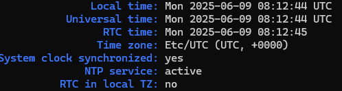

# Project InfraCore

## Linux Active Directory Lab with DNS, DHCP, Mail, and Nextcloud

This project provides a fully functional Linux-based lab environment that simulates a small enterprise network with multiple subnets, Active Directory (Samba), DNS routing, DHCP, a mail server, and Nextcloud integration.

<p align="center">
  <a href="#overview">Overview</a> •
  <a href="#hyper-v-setup">Hyper-V Setup</a> •
  <a href="#router-setup">Router Setup</a> •
  <a href="#ad-dns-servers-setup">AD/DNS Servers Setup</a> •
  <a href="#dhcp-server-setup">DHCP Server Setup</a> •
  <a href="#windows-clients-setup">Windows Clients AD Join</a>
</p>

---

<div align="center">
  <h2 id="overview">Overview</h2>
</div>

<p align="center">
  <a href="#network-structure">Network Structure</a> •
  <a href="#components">Components</a> •
  <a href="#technologies-used">Technologies Used</a> •
  <a href="#system-requirements">System Requirements</a>
</p>
Project InfraCore provides a comprehensive lab environment for learning and testing enterprise network configurations. The setup includes multiple interconnected subnets, domain controllers, and various network services to simulate a real-world corporate environment.

The domain I'm using is `smoke-break.lan`. It's an inside joke among my classmates.

<h4 id="network-structure">Network Structure</h4>

| Network | Description | Subnet | Router Interface IP |
| :--- | :--- | :--- | :--- |
| Private 1 | Building 1 Clients | 192.168.10.0/24 | 192.168.10.254 |
| Private 2 | Interbuilding (Bridge) | 172.16.0.0/16 | 172.16.0.1, 172.16.0.2 |
| Private 3 | Building 2 Clients | 192.168.20.0/24 | 192.168.20.254 |
| WAN | Internet Access | DHCP or Static | Depends on Host |

<details align="center">
  <summary>
  <h3>Visual Example</h3>
  </summary>
  
</details>

<h4 id="components">Components</h4>

*   **2 Router VMs** with IP forwarding and NAT
*   **2 AD/DNS Servers** (`samba`)
*   **1 DHCP Server**
*   **1 Mail Server** *(Setup guide to be added)*
*   **1 Nextcloud Server** *(Setup guide to be added)*
*   **2 Client VMs**

<h4 id="technologies-used">Technologies Used</h4>

*   Ubuntu Server 24.04 LTS
*   Samba (Active Directory domain controller)
*   `iptables` (NAT/routing)
*   Netplan (for IP management)
*   Hyper-V (Virtualization platform example)

<h4 id="system-requirements">System Requirements (HOST)</h4>

*   **Minimum**: 4 CPU cores, 16 GB RAM
*   **Recommended**: 8+ CPU cores, 32+ GB RAM
*   **Storage**: At least 250 GB free space
*   **Virtualization software**: VirtualBox, VMware, or Hyper-V
*   **Hardware virtualization**: Virtualization must be enabled in BIOS/UEFI settings (Intel VT-x/AMD-V)

> [!CAUTION]
> Before installing any virtualization software, ensure that hardware virtualization is enabled in your system's BIOS/UEFI settings. This is typically found under CPU settings as "Virtualization Technology," "VT-x," "AMD-V," or similar.

---

<div align="center">
  <h2 id="hyper-v-setup">Hyper-V Setup</h2>
</div>

This guide explains how to configure the virtual machines for the lab environment. In this example, we're using Windows 11 Pro with Hyper-V.

### 1. Enable Hyper-V (Windows Host)

Before creating VMs, enable Hyper-V by running this command in an **Administrator PowerShell** session. Reboot your system if prompted.

```powershell
Enable-WindowsOptionalFeature -Online -FeatureName Microsoft-Hyper-V -All
```

> [!NOTE]
> If you prefer a manual, step-by-step tutorial on creating a VM, [click here](Hyper-VSetup.md).

### 2. Automated VM Creation Script

For faster deployment, use the provided PowerShell script to create all 9 VMs automatically.

First, download the script to your user directory:

```powershell
# Download the script
$scriptUrl = "https://raw.githubusercontent.com/fIyingPhoenix/InfraCore/main/VM-Create.ps1"
$outputPath = "$HOME/VM-Create.ps1"
Invoke-WebRequest -Uri $scriptUrl -OutFile $outputPath
```

Next, open the script in a text editor to configure it for your system.

```powershell
# Edit the file
notepad.exe $outputPath
```

**Required Modifications:**

1.  **ISO Paths**: Update `$ISO_Client` and `$ISO_Server` with the full paths to your Windows and Ubuntu ISO files.
2.  **Memory Allocation**: Adjust `$MemoryMinimumBytes`, `$MemoryMaximumBytes`, and `$MemoryStartupBytes` as needed for your system.
3.  **Storage Locations**: Set `$VMPath` (for VM state files) and `$VHDPath` (for virtual hard disks) to your desired locations.

### 3. Run the Script

Once configured, run the script from an **Administrator PowerShell** session to create or remove the lab environment.

```powershell
# Navigate to the directory where the script was saved
cd $HOME

# To CREATE all VMs and virtual switches
.\VM-Create.ps1 -Install

# To REMOVE all VMs and associated resources
.\VM-Create.ps1 -Uninstall
```


> [!TIP]
> After creation, check the boot order for each VM. For the Windows 11 clients, ensure they have at least 4GB of RAM and 2 vCPUs to meet minimum system requirements.

### 4. Initial VM Setup

Start the VMs and install their operating systems.

*   [Ubuntu Installation Guide](UbuntuServerInstall.md) *(Setup guide to be added)*
*   [Windows Installation Guide](WindowsClientInstall.md) *(Setup guide to be added)*

> [!CAUTION]
> **Install the two Router VMs first.** Initially, each router VM should only have one network adapter connected to your WAN/Internet switch (e.g., "Default Switch"). The other VMs will be installed *after* the routers are fully configured, as they will rely on the routers for internet access during their own OS installation.

---

<div align="center">
  <h2 id="router-setup">Router Setup</h2>
</div>

This section covers configuring two Ubuntu Server VMs to act as routers. Router 1 will be the main internet gateway, and Router 2 will handle traffic for a separate subnet, connected via an internal network.

<p align="center">
  <a href="#router-1-configuration">Router 1 Configuration</a> •
  <a href="#router-2-configuration">Router 2 Configuration</a> •
  <a href="#final-verification">Final Verification</a>
</p>

<h3 id="router-1-configuration">Router 1 Configuration (Main Gateway)</h3>

Router 1 connects the WAN, Building 1 (`Private 1`), and the inter-building network (`Private 2`).

#### 1. Prepare the System

First, update the system, install required packages, and set the hostname.

```bash
# Update system and install tools
sudo apt update && sudo apt full-upgrade -y
sudo apt install -y nano netfilter-persistent iptables iputils-ping
sudo reboot

# Set the hostname
sudo hostnamectl set-hostname router1.smoke-break.lan
echo "127.0.0.1 localhost" | sudo tee /etc/hosts
echo "127.0.1.1 router1.smoke-break.lan router1" | sudo tee -a /etc/hosts
```

#### 2. Add Network Interfaces

In Hyper-V, add two more network adapters to the `Linux - Router 1` VM:
1.  **NIC 2:** Connected to `PrivateSwitch 1`
2.  **NIC 3:** Connected to `PrivateSwitch 2`

Or, use PowerShell:
```powershell
Add-VMNetworkAdapter -VMName "Linux - Router 1" -SwitchName "PrivateSwitch 1"
Add-VMNetworkAdapter -VMName "Linux - Router 1" -SwitchName "PrivateSwitch 2"
```

#### 3. Configure Netplan

Verify your interface names (`ip a`) and then configure them. They will likely be `eth0` (WAN), `eth1` (Private 1), and `eth2` (Private 2).
```bash
ip a
```


Navigate to netplan config:
```bash
cd /etc/netplan && ls
```


Identify your YAML file (e.g., `00-installer-config.yaml` or `50-cloud-init.yaml`).

```bash
# Create a backup of the original config
sudo cp /etc/netplan/50-cloud-init.yaml /etc/netplan/50-cloud-init.yaml.bak

# Edit the configuration file
sudo nano /etc/netplan/50-cloud-init.yaml
```

Replace the contents with the following, adjusting interface names if necessary:

```yaml
network:
  version: 2
  renderer: networkd
  ethernets:
    eth0: # WAN interface
      dhcp4: true # Or use static if your WAN requires it
      nameservers:
        addresses: [1.1.1.1, 1.0.0.1] # Cloudflare DNS, good choice
    eth1: # Building 1 clients (PrivateSwitch 1)
      addresses:
        - 192.168.10.254/24
    eth2: # Bridge to Router 2 (PrivateSwitch 2)
      addresses:
        - 172.16.0.1/16
      routes:
        - to: 192.168.20.0/24 # Route to Building 2 network
          via: 172.16.0.2    # via Router 2's interbuilding interface
```

Apply the new network configuration:

```bash
sudo netplan try  # Test the configuration for errors
sudo netplan apply
```
> [!TIP]
> If you encounter an error, carefully check spacing and syntax in the YAML file.

#### 4. Enable IP Forwarding & NAT

Enable packet forwarding and set up a NAT rule to allow internal clients to access the internet.

```bash
# Enable IPv4 forwarding permanently
echo "net.ipv4.ip_forward=1" | sudo tee /etc/sysctl.d/99-ipforward.conf
sudo sysctl -p /etc/sysctl.d/99-ipforward.conf

# Create a NAT rule for traffic going out the WAN interface (eth0)
sudo iptables -t nat -A POSTROUTING -o eth0 -j MASQUERADE

# Save the iptables rule so it persists after reboots
sudo netfilter-persistent save
```

<h3 id="router-2-configuration">Router 2 Configuration (Sub-Router)</h3>

Router 2 connects the inter-building network (`Private 2`) and Building 2 (`Private 3`).

#### 1. Prepare the System

```bash
# Update system and install tools
sudo apt update && sudo apt full-upgrade -y
sudo apt install -y nano netfilter-persistent iptables iputils-ping
sudo reboot

# Set the hostname
sudo hostnamectl set-hostname router2.smoke-break.lan
echo "127.0.0.1 localhost" | sudo tee /etc/hosts
echo "127.0.1.1 router2.smoke-break.lan router2" | sudo tee -a /etc/hosts
```

#### 2. Configure Network Interfaces

In Hyper-V, modify the network adapters for the `Linux - Router 2` VM:
1.  **Existing NIC:** Change its connection from WAN to `PrivateSwitch 2`.
2.  **Add New NIC:** Add a new adapter and connect it to `PrivateSwitch 3`.

Or, use PowerShell:
```powershell
# Set the existing NIC of Router 2 to PrivateSwitch 2
# (If you have multiple NICs, identify the correct one to modify)
# Example: Get-VMNetworkAdapter -VMName "Linux - Router 2" | ? SwitchName -eq "Default Switch" | Connect-VMNetworkAdapter -SwitchName "PrivateSwitch 2"
# Or, if it's the only one/you know its default name (often "Network Adapter"):
Connect-VMNetworkAdapter -VMName "Linux - Router 2" -Name "Network Adapter" -SwitchName "PrivateSwitch 2"

# Add the new NIC for PrivateSwitch 3
Add-VMNetworkAdapter -VMName "Linux - Router 2" -SwitchName "PrivateSwitch 3"
```
> [!TIP]
> The `Connect-VMNetworkAdapter` command modifies an existing adapter. Use `Get-VMNetworkAdapter -VMName "Linux - Router 2"` to list adapters if unsure of the name.

#### 3. Configure Netplan

Verify your interface names (`ip a`) and then configure them. They will likely be `eth0` (Private 2, connected to `PrivateSwitch 2`) and `eth1` (Private 3, connected to `PrivateSwitch 3`).

```bash
# Create a backup of the original config
sudo cp /etc/netplan/50-cloud-init.yaml /etc/netplan/50-cloud-init.yaml.bak

# Edit the configuration file
sudo nano /etc/netplan/50-cloud-init.yaml
```

Replace the contents with the following:
```yaml
network:
  version: 2
  renderer: networkd
  ethernets:
    eth0: # Interbuilding interface (PrivateSwitch 2)
      addresses:
        - 172.16.0.2/16
      routes:
        - to: default
          via: 172.16.0.1 # Default gateway is Router 1
        - to: 192.168.10.0/24 # Route to Building 1 network
          via: 172.16.0.1    # via Router 1
      nameservers: # Add nameservers for Router 2 itself to resolve external names
        addresses: [1.1.1.1, 1.0.0.1] # Or your internal DNS once they are up
    eth1: # Building 2 clients (PrivateSwitch 3)
      addresses:
        - 192.168.20.254/24 # Matches network table for router interface IP
```

Apply the new network configuration:
```bash
sudo netplan try
sudo netplan apply
```

#### 4. Enable IP Forwarding & NAT

Enable packet forwarding. NAT on Router 2 for traffic from Building 2 going to the inter-building link simplifies the setup by hiding the `192.168.20.0/24` network from Router 1's direct routing table (Router 1 only needs to know how to reach `172.16.0.2`).

```bash
# Enable IPv4 forwarding permanently
echo "net.ipv4.ip_forward=1" | sudo tee /etc/sysctl.d/99-ipforward.conf
sudo sysctl -p /etc/sysctl.d/99-ipforward.conf

# NAT for traffic from Building 2 (eth1) going out via Interbuilding link (eth0)
sudo iptables -t nat -A POSTROUTING -o eth0 -j MASQUERADE

# Allow forwarding from Building 2 (inbound on eth1) to Interbuilding link (outbound on eth0)
sudo iptables -A FORWARD -i eth1 -o eth0 -j ACCEPT
# Allow established and related traffic back from Interbuilding link (inbound on eth0) to Building 2 (outbound on eth1)
sudo iptables -A FORWARD -i eth0 -o eth1 -m state --state RELATED,ESTABLISHED -j ACCEPT

# Save iptables rules
sudo netfilter-persistent save
```

<h3 id="final-verification">Final Verification</h3>

Test connectivity from both routers to ensure everything is working.

```bash
# From Router 1:
ping -c 3 172.16.0.2      # Ping Router 2's inter-building IP
ping -c 3 192.168.20.254  # Ping Router 2's LAN IP (tests static route on Router 1 and forwarding/NAT on Router 2)
ping -c 3 1.1.1.1         # Ping the internet

# From Router 2:
ping -c 3 172.16.0.1      # Ping Router 1's inter-building IP
ping -c 3 192.168.10.254  # Ping Router 1's LAN IP (tests routing through R1)
ping -c 3 1.1.1.1         # Ping the internet (tests default route and NAT through R1)
```

---

<div align="center">
  <h2 id="ad-dns-servers-setup">AD/DNS Servers Setup (Samba Internal DNS)</h2>
</div>

<p align="center">
  <a href="#ad-dns-prerequisites">Prerequisites</a> •
  <a href="#dns1-setup">Primary DC Setup</a> •
  <a href="#dns2-setup">Secondary DC Setup</a> •
  <a href="#internal-ca-setup">Internal CA Setup</a> •
  <a href="#reverse-dns-zone-setup">Reverse DNS Zone</a>
</p>
This section details how to configure two Ubuntu servers as Active Directory Domain Controllers using Samba. We will use `Linux - AD_DNS 1` as the Primary DC (`dns1`) and `Linux - AD_DNS 2` as the Secondary DC (`dns2`).

### 1. Initial VM & Network Preparation

1.  **Network Connections**:
    *   Connect `Linux - AD_DNS 1` VM to `PrivateSwitch 1`.
    *   Connect `Linux - AD_DNS 2` VM to `PrivateSwitch 3`.

2.  **Static IP Configuration (During Ubuntu Install)**:
    It is critical that Domain Controllers have static IP addresses. Configure this during the OS installation.

    **Server 1 (`dns1`) Static IP:**
    *   **Subnet:** `192.168.10.0/24`
    *   **IP Address:** `192.168.10.101`
    *   **Gateway:** `192.168.10.254`
    *   **DNS Servers:** `1.1.1.1` (This is temporary; we will change it later to the DC itself)
    *   **Search Domain:** `smoke-break.lan`

    **Server 3 (`dns2`) Static IP:**
    *   **Subnet:** `192.168.20.0/24`
    *   **IP Address:** `192.168.20.101`
    *   **Gateway:** `192.168.20.254`
    *   **DNS Servers:** `1.1.1.1` (Temporary; will be changed later)
    *   **Search Domain:** `smoke-break.lan`


<h3 id="ad-dns-prerequisites">Prerequisites (Run on BOTH AD/DNS Servers)</h3>

After installing Ubuntu, SSH into both `dns1` and `dns2` and run the following commands.

```bash
# Update system and install all required packages
sudo apt update && sudo apt full-upgrade -y
sudo apt install -y nano ufw iputils-ping samba krb5-user krb5-config winbind libpam-winbind libnss-winbind chrony dnsutils

sudo reboot
```

> [!TIP]
> During the `krb5-user` installation, you may be prompted for a Kerberos realm. You can leave this blank or accept the default; Samba provisioning will configure it correctly later.

Next, verify that time synchronization is active, which is critical for Kerberos.
```bash
sudo systemctl start chrony
sudo systemctl enable chrony
# Check time sync status
timedatectl status
```
Look for `System clock synchronized: yes` and `NTP service: active`.



### Part A: Samba AD Domain Provisioning

<h3 id="dns1-setup">Primary Domain Controller Setup (`dns1`)</h3>

Perform these steps only on `Linux - AD_DNS 1`.

#### Step 1: Configure Hostname and Hosts File
```bash
sudo hostnamectl set-hostname dns1.smoke-break.lan
sudo nano /etc/hosts
```
Ensure `/etc/hosts` looks like this (remove or comment out the `127.0.1.1` line if it exists for `dns1`):
```plaintext
127.0.0.1       localhost
192.168.10.101  dns1.smoke-break.lan dns1
# The following line should be removed or commented out if present:
# 127.0.1.1       dns1.smoke-break.lan dns1
```

#### Step 2: Provision the Samba AD Domain and Prepare for LDAPS

Stop services that can interfere with the provisioning process.
```bash
sudo systemctl stop smbd nmbd winbind systemd-resolved
sudo systemctl disable smbd nmbd winbind systemd-resolved
```
Backup existing Samba config:
```bash
sudo mv /etc/samba/smb.conf /etc/samba/smb.conf.bak # Or .old if .bak exists
```

Now, provision the domain.
```bash
sudo samba-tool domain provision --use-rfc2307 --interactive
```
Answer the prompts as follows:
*   **Realm:** `SMOKE-BREAK.LAN` (ALL CAPS)
*   **Domain:** `SMOKE-BREAK` (ALL CAPS, this is the NetBIOS domain name)
*   **Server Role:** `dc`
*   **DNS backend:** `SAMBA_INTERNAL`
*   **DNS forwarder IP address:** `1.1.1.1` (or your preferred external DNS)
*   **Administrator password:** Choose a strong password and record it.

> [!TIP]
> Provisioning can take time. If it hangs for 15-20+ minutes:
> 1. `Ctrl+C` to cancel.
> 2. `ps aux | grep samba` to check for stuck processes.
> 3. `sudo pkill -f samba` if any are found.
> 4. Restore `smb.conf.bak` if necessary, ensure `/etc/resolv.conf` (temporarily pointing to an external DNS like 1.1.1.1) is correct, and retry `samba-tool domain provision ... -d 5` for debug info.
> 5. Check logs: `less /var/log/samba/log.samba`

A robust `smb.conf` for `dns1` will be generated by the provision. You can then enhance it. The following is an example of a well-configured `smb.conf` that includes TLS settings for LDAPS (which we'll set up later with a CA). You can replace the generated `/etc/samba/smb.conf` with this content after provisioning:
```ini
# Global parameters
[global]
        # --- Basic AD DC Settings ---
        netbios name = DNS1
        realm = SMOKE-BREAK.LAN
        workgroup = SMOKE-BREAK
        server role = active directory domain controller

        # --- DNS Configuration ---
        dns forwarder = 1.1.1.1
        # Or your preferred external DNS (e.g., your router's IP, 8.8.8.8)
        allow dns updates = secure
        # Default for SAMBA_INTERNAL, good to be explicit

        # --- TLS Settings for LDAPS (Paths for certificates we will create later) ---
        # Turn on TLS (Transport Layer Security), which enables LDAPS
        # To allow secure, encrypted connections to the AD
        tls enabled = yes
        # Tell Samba where to find the server's private key, public certificate and CA's public certificate
        # Samba needs this to decrypt incoming secure connections and prove its identity.
        tls keyfile = /etc/samba/tls/key.pem
        # Samba sends this to clients to prove it's the real server
        tls certfile = /etc/samba/tls/cert.pem
        # Used if Samba needs to verify certificates from clients, or to help clients build the trust chain.
        tls cafile = /etc/samba/tls/ca.pem

        # --- LDAP Security ---
        # This ensures clients must use encrypted connections (LDAPS) or StartTLS for LDAP
        ldap server require strong auth = yes
        # Sets a timeout for LDAP operations (in seconds), helps avoid hanging connections.
        ldap timeout = 15

        # --- Logging (adjust levels as needed for troubleshooting) ---
        log file = /var/log/samba/log.%m
        # 50MB per file
        max log size = 50000
        logging = file
        log level = 1
        # Default production level; increase for debugging (e.g., 3 or higher)
        # For very verbose DNS debugging on this DC:
        # dns:log level = 5

# --- Standard AD Shares ---
[sysvol]
        path = /var/lib/samba/sysvol
        read only = No

[netlogon]
        path = /var/lib/samba/sysvol/smoke-break.lan/scripts
        read only = No
```
Save the file if you modified it (`Ctrl+X`, `Y`, `Enter` in `nano`).

#### Step 3: Configure Kerberos
Copy the Kerberos configuration generated by Samba.
```bash
sudo cp /var/lib/samba/private/krb5.conf /etc/krb5.conf
```
You can enhance `/etc/krb5.conf`. The copied version is usually sufficient, but here's a more robust example. Ensure `dns1.smoke-break.lan` is listed under `kdc` and `admin_server`.
```bash
sudo nano /etc/krb5.conf
```
Replace with or adapt to the following:
```ini
[libdefaults]
    # Define your default Kerberos realm
    default_realm = SMOKE-BREAK.LAN

    # When set to true, use DNS SRV records to find KDCs.
    # This is generally recommended for AD environments and allows dynamic discovery.
    # Samba's internal DNS will serve these records.
    dns_lookup_kdc = true

    # When set to true, use DNS TXT records to find the realm for a host.
    # Typically set to false in an AD environment as the realm is fixed.
    dns_lookup_realm = true

    # Time synchronization is critical for Kerberos.
    # This tells the client to check time difference with KDC.
    kdc_timesync = 1

    # Standard ticket cache type.
    ccache_type = 4

    # Allow tickets to be forwardable (necessary for many services).
    forwardable = true

    # Allow tickets to be proxiable.
    proxiable = true

    # Disable reverse DNS lookups for KDC hostnames, can improve performance
    # and avoid issues if rDNS isn't perfectly configured.
    rdns = false

    # For compatibility with MIT Kerberos ticket flags.
    fcc-mit-ticketflags = true

    # OPTIONAL: Explicitly define strong encryption types.
    # Samba AD supports AES by default. This ensures clients prefer/require them.
    # Order matters: strongest preferred first.
    default_tgs_enctypes = aes256-cts-hmac-sha1-96 aes128-cts-hmac-sha1-96
    default_tkt_enctypes = aes256-cts-hmac-sha1-96 aes128-cts-hmac-sha1-96
    permitted_enctypes = aes256-cts-hmac-sha1-96 aes128-cts-hmac-sha1-96

    # OPTIONAL: Adjust ticket lifetimes if needed (defaults are usually 10h ticket, 7d renew).
    ticket_lifetime = 24h
    renew_lifetime = 7d

[realms]
    # Define specifics for your realm.
    # If dns_lookup_kdc = true, the 'kdc' and 'admin_server' lines here
    # act as a fallback or can be omitted if SRV records are reliably found.
    # However, it's good practice to list your primary ones.
    SMOKE-BREAK.LAN = {
        default_domain = smoke-break.lan
        # List your Key Distribution Centers (Domain Controllers).
        # If dns_lookup_kdc = true, these are fallbacks.
        # If dns_lookup_kdc = false, these are the ONLY KDCs that will be used.
        kdc = dns1.smoke-break.lan
        # Add your secondary DC when it's operational

        # Server for kadmin (Kerberos administration tool).
        admin_server = dns1.smoke-break.lan # Usually the primary DC
    }

[domain_realm]
    # Maps DNS domain names to Kerberos realms.
    .smoke-break.lan = SMOKE-BREAK.LAN
    smoke-break.lan = SMOKE-BREAK.LAN

# OPTIONAL: For detailed Kerberos client-side logging (useful for troubleshooting)
# [logging]
#  default = FILE:/var/log/krb5libs.log
#  kdc = FILE:/var/log/krb5kdc.log        # Not used by clients, but KDCs can use this
#  admin_server = FILE:/var/log/kadmind.log # Not used by clients
```

#### Step 4: Configure DNS Resolution
The DC must use itself for DNS.
```bash
# Make /etc/resolv.conf writable (if it's a symlink controlled by systemd-resolved, which should be disabled)
sudo rm -f /etc/resolv.conf

# Set the DC to use itself for DNS
echo "search smoke-break.lan" | sudo tee /etc/resolv.conf
echo "nameserver 127.0.0.1" | sudo tee -a /etc/resolv.conf

# Make the file immutable to prevent other services from overwriting it
sudo chattr +i /etc/resolv.conf
```

#### Step 5: Start Services and Verify
```bash
sudo systemctl unmask samba-ad-dc # Ensure service is not masked
sudo systemctl enable samba-ad-dc
sudo systemctl start samba-ad-dc
# It's good practice to reboot to ensure everything starts correctly
sudo reboot
```
After rebooting, log back in and verify the domain is working:
```bash
# Test DNS records (wait a minute or two for services to fully start)
host -t SRV _ldap._tcp.smoke-break.lan.
host -t A dns1.smoke-break.lan.

# Test Kerberos authentication
kinit administrator # Enter the password you set during provisioning
klist # Should show a ticket for the administrator user
```

#### Step 6: Configure Firewall
```bash
# Allow all necessary AD ports
sudo ufw allow 22/tcp         # SSH
sudo ufw allow 53/tcp         # DNS
sudo ufw allow 53/udp         # DNS
sudo ufw allow 88/tcp         # Kerberos
sudo ufw allow 88/udp         # Kerberos
sudo ufw allow 135/tcp        # RPC Endpoint Mapper
sudo ufw allow 137/udp        # NetBIOS Name Service
sudo ufw allow 138/udp        # NetBIOS Datagram Service
sudo ufw allow 139/tcp        # NetBIOS Session Service (SMB over NetBIOS)
sudo ufw allow 389/tcp        # LDAP
sudo ufw allow 389/udp        # LDAP CLDAP (used by DC Locator)
sudo ufw allow 445/tcp        # SMB/CIFS (Direct Host)
sudo ufw allow 464/tcp        # Kerberos kpasswd
sudo ufw allow 464/udp        # Kerberos kpasswd
sudo ufw allow 636/tcp        # LDAPS (Secure LDAP)
sudo ufw allow 3268/tcp       # Global Catalog
sudo ufw allow 3269/tcp       # Global Catalog Secure
sudo ufw allow proto tcp from any to any port 49152:65535 # RPC Dynamic Ports (adjust 'from any' if needed for security)
# For UDP RPC, though less common for critical replication:
# sudo ufw allow proto udp from any to any port 49152:65535
sudo ufw enable
sudo ufw status verbose
```

---

<h3 id="dns2-setup">Secondary Domain Controller Setup (`dns2`)</h3>

Perform these steps only on `Linux - AD_DNS 2`.

#### Step 1: Configure Hostname and Hosts File
```bash
sudo hostnamectl set-hostname dns2.smoke-break.lan
sudo nano /etc/hosts
```
Ensure `/etc/hosts` looks like this (remove or comment out the `127.0.1.1` line if it exists for `dns2`):
```plaintext
127.0.0.1       localhost
192.168.20.101  dns2.smoke-break.lan dns2
# The following line should be removed or commented out if present:
# 127.0.1.1       dns2.smoke-break.lan dns2
```

#### Step 2: Join the Domain
Stop potentially interfering services:
```bash
sudo systemctl stop smbd nmbd winbind systemd-resolved
sudo systemctl disable smbd nmbd winbind systemd-resolved
```
Configure `/etc/resolv.conf` to point to the Primary DC (`dns1`) for the join process. This is crucial.
```bash
sudo rm -f /etc/resolv.conf # Remove if it's a symlink
echo "search smoke-break.lan" | sudo tee /etc/resolv.conf
echo "nameserver 192.168.10.101" | sudo tee -a /etc/resolv.conf # Point to dns1
sudo chattr +i /etc/resolv.conf
```
Backup existing Samba config (if any):
```bash
sudo mv /etc/samba/smb.conf /etc/samba/smb.conf.bak # If it exists
```

Now, join the domain as a second DC.
```bash
# Use the -U flag to specify the domain administrator and realm explicitly if needed
sudo samba-tool domain join smoke-break.lan DC -U"SMOKE-BREAK\administrator" --dns-backend=SAMBA_INTERNAL
```
Enter the Administrator password (the one set on `dns1`) when prompted.

After joining, Samba will create an `smb.conf`. You can replace it with a configuration similar to `dns1`'s, adjusting the `netbios name`. Example for `dns2`:
```ini
# Global parameters
[global]
        # --- Basic AD DC Settings ---
        netbios name = DNS2 # Changed for dns2
        realm = SMOKE-BREAK.LAN
        workgroup = SMOKE-BREAK
        server role = active directory domain controller

        # --- DNS Configuration ---
        dns forwarder = 1.1.1.1 # Or 192.168.10.101 (dns1)
        allow dns updates = secure

        # --- TLS Settings for LDAPS (Paths for certificates we will create later) ---
        tls enabled = yes
        tls keyfile = /etc/samba/tls/key.pem
        tls certfile = /etc/samba/tls/cert.pem
        tls cafile = /etc/samba/tls/ca.pem

        # --- LDAP Security ---
        ldap server require strong auth = yes
        ldap timeout = 15
        # The 'ldap ssl = no' line you had is for Samba acting as an LDAP *client*.
        # It's not needed for a DC and doesn't affect LDAPS availability for incoming connections.

        # --- Logging ---
        log file = /var/log/samba/log.%m
        max log size = 50000
        logging = file
        log level = 1
        # dns:log level = 5 # For verbose DNS debugging

[sysvol]
        path = /var/lib/samba/sysvol
        read only = No

[netlogon]
        path = /var/lib/samba/sysvol/smoke-break.lan/scripts
        read only = No
```

#### Step 3: Configure Kerberos
Copy the Kerberos configuration, which should now be replicated or created by the join process.
```bash
sudo cp /var/lib/samba/private/krb5.conf /etc/krb5.conf
```
Edit `/etc/krb5.conf` on `dns2` to be similar to `dns1`'s, but ensure `dns2` is also listed as a KDC.
```bash
sudo nano /etc/krb5.conf
```
```ini
[libdefaults]
    default_realm = SMOKE-BREAK.LAN
    dns_lookup_kdc = true
    dns_lookup_realm = true
    kdc_timesync = 1
    ccache_type = 4
    forwardable = true
    proxiable = true
    rdns = false

    fcc-mit-ticketflags = true
    default_tgs_enctypes = aes256-cts-hmac-sha1-96 aes128-cts-hmac-sha1-96
    default_tkt_enctypes = aes256-cts-hmac-sha1-96 aes128-cts-hmac-sha1-96
    permitted_enctypes = aes256-cts-hmac-sha1-96 aes128-cts-hmac-sha1-96

    ticket_lifetime = 24h
    renew_lifetime = 7d

[realms]
        default_domain = smoke-break.lan
        kdc = dns1.smoke-break.lan
        kdc = dns2.smoke-break.lan
        # Server for kadmin (Kerberos administration tool).
        admin_server = dns1.smoke-break.lan # Usually the primary DC
    }

[domain_realm]
    # Maps DNS domain names to Kerberos realms.
    .smoke-break.lan = SMOKE-BREAK.LAN
    smoke-break.lan = SMOKE-BREAK.LAN
```
Ensure the rest of the file matches the robust configuration used on `dns1` (encryption types, etc.).

#### Step 4: Configure DNS Resolution
Configure `dns2` to use itself first for DNS, then `dns1` as a backup.
```bash
# Make file writable again if it was made immutable (it shouldn't be yet on dns2)
# sudo chattr -i /etc/resolv.conf # Only if it was previously set immutable

# Configure primary and secondary DNS servers
echo "search smoke-break.lan" | sudo tee /etc/resolv.conf
echo "nameserver 127.0.0.1" | sudo tee -a /etc/resolv.conf       # Use itself first
echo "nameserver 192.168.10.101" | sudo tee -a /etc/resolv.conf # Then dns1

# Make immutable
sudo chattr +i /etc/resolv.conf
```

#### Step 5: Start Services and Verify
```bash
sudo systemctl unmask samba-ad-dc
sudo systemctl enable samba-ad-dc
sudo systemctl start samba-ad-dc
sudo reboot
```
After rebooting, log back in and verify domain services and replication.
```bash
# On dns2, check that DNS returns both DCs for SRV records
host -t SRV _ldap._tcp.smoke-break.lan.
host -t A dns2.smoke-break.lan.

# On either DC (e.g., dns1), check replication status
sudo samba-tool drs showrepl
```
The output should show successful replication attempts (INBOUND and OUTBOUND) between `dns1` and `dns2`.

#### Step 6: Configure Firewall
Apply the exact same `ufw` rules on `dns2` as you did for [`dns1`'s firewall setup](#step-6-configure-firewall).

<h3 id="internal-ca-setup">Part B: Certificate Authority Setup (Internal CA)</h3>
We're creating a "Certificate Authority" (CA). This CA will issue digital ID cards (certificates) that devices on your `smoke-break.lan` network will trust. This is essential for secure LDAPS. Perform these steps on `dns1` (or a dedicated CA machine, but for this lab, `dns1` is fine).

#### Step 1: Prepare CA Directory Structure

> [!TIP]
> Ensure you are the root user for these commands to manage CA files properly: `sudo su -`

```bash
# Create the root directory for all CA files
mkdir /root/internal-ca
cd /root/internal-ca

# Create sub-folders for different types of CA files
mkdir certs crl newcerts private

# Secure the 'private' folder (only root access)
chmod 700 private

# Create an index file (database for issued certificates)
touch index.txt

# Create a serial file (tracks next certificate serial number)
echo 1000 > serial
```

#### Step 2: Create CA Configuration File (`openssl.cnf`)
This file tells `openssl` how your CA should operate.
```bash
nano /root/internal-ca/openssl.cnf
```
Paste the following configuration into `openssl.cnf`:
*(This is a standard configuration for a simple CA. Adapt the `[req_distinguished_name]` defaults if desired.)*
```ini
[ ca ]
default_ca = CA_default                     # Tells OpenSSL which section below has the main CA settings.
# Defines where all the CA's working files and folders are
# Helps OpenSSL find everything it needs.
[ CA_default ]
dir               = /root/internal-ca       # Main CA folder we created
certs             = $dir/certs              # Folder for issued certificates
crl_dir           = $dir/crl                # Folder for certificate revocation lists
database          = $dir/index.txt          # The 'database' of issued certs
new_certs_dir     = $dir/newcerts           # Folder for newly created certs
certificate       = $dir/cacert.pem         # The CA certificate
serial            = $dir/serial             # The current serial number
crl               = $dir/crl.pem            # The current CRL
private_key       = $dir/private/cakey.pem  # The private key
RANDFILE          = $dir/private/.rand      # Private random number file

# Sets default options for certificates issued by this CA.
# Ensures consistency for all issued certificates.
x509_extensions   = usr_cert                # Default extensions for user certificates
name_opt          = ca_default              # Formatting options for names
cert_opt          = ca_default              # Formatting options for certificates
default_days      = 1825                    # How long to certify for (5 years)
default_crl_days  = 30                      # How long before next CRL
default_md        = sha256                  # Use SHA-256 for Signatures
preserve          = no                      # Don't preserve old field values in requests
policy            = policy_match            # Which policy section to use for matching certificate request info

# Defines rules for information in certificate requests.
# 'match' means the info in the request must match the CA's info. 'supplied' means it must be provided. 'optional' means it's not required.
# Ensures certificate requests have the necessary information.
[ policy_match ] # In Use
countryName             = match
stateOrProvinceName     = match
organizationName        = match
organizationalUnitName  = optional
commonName              = supplied
emailAddress            = optional

[ policy_anything ]
countryName             = optional
stateOrProvinceName     = optional
localityName            = optional
organizationName        = optional
organizationalUnitName  = optional
commonName              = supplied
emailAddress            = optional

[ req ]
default_bits        = 2048                      # Default key strength, djusted from 4096 for faster lab certs if preferred, 2048 is still strong
default_keyfile     = privkey.pem               # Default name for new private keys
distinguished_name  = req_distinguished_name
attributes          = req_attributes
x509_extensions     = v3_ca                     # The extensions to add to the self signed cert

[ req_distinguished_name ]
countryName                     = Country Name (2 letter code)
countryName_default             = DE
stateOrProvinceName             = State or Province Name (full name)
stateOrProvinceName_default     = Reinstated Pfalz
localityName                    = Locality Name (eg, city)
localityName_default            = Trier
0.organizationName              = Organization Name (eg, company)
0.organizationName_default      = Smoke Break LAN
organizationalUnitName          = Organizational Unit Name (eg, section)
#organizationalUnitName_default =
commonName                      = Common Name (e.g. server FQDN or YOUR name)
commonName_max                  = 64

[ req_attributes ]
challengePassword               = A challenge password
challengePassword_min           = 4
challengePassword_max           = 20

[ usr_cert ]
basicConstraints = CA:FALSE
nsComment = "OpenSSL Generated Certificate"
subjectKeyIdentifier = hash
authorityKeyIdentifier = keyid,issuer

[ v3_ca ] # Settings for the CA's own certificate
subjectKeyIdentifier = hash
authorityKeyIdentifier = keyid:always,issuer
basicConstraints = critical, CA:true
keyUsage = critical, digitalSignature, cRLSign, keyCertSign

[ server_cert ] # Settings specific for server certificates (like for our web/mail servers)
basicConstraints = CA:FALSE
nsCertType = server
nsComment = "OpenSSL Generated Server Certificate"
subjectKeyIdentifier = hash
authorityKeyIdentifier = keyid,issuer:always
keyUsage = critical, digitalSignature, keyEncipherment
extendedKeyUsage = serverAuth, clientAuth # For LDAPS, serverAuth is key; clientAuth can be useful

[ crl_ext ]
authorityKeyIdentifier=keyid:always
```
Save and exit `nano`.

#### Step 3: Create the CA's Master Key and Root Certificate
```bash
# Still in /root/internal-ca as root user
# Create the CA's master private key (encrypted with AES256)
openssl genrsa -aes256 -out private/cakey.pem 4096
#    'openssl genrsa': Generate an RSA private key.
#    '-aes256': Encrypt this key with AES256. You'll be prompted for a passphrase.
#    '-out private/cakey.pem': Save the key in 'private/cakey.pem'.
#    '4096': Key length in bits (very strong).
```
> [!IMPORTANT]
> When prompted "Enter pass phrase for private/cakey.pem:", type a strong passphrase, press Enter, and re-enter it. **Store this passphrase securely! Losing it means you cannot use your CA.**

```bash
# Create the CA's self-signed root certificate (public ID card)
openssl req -config openssl.cnf -key private/cakey.pem -new -x509 -days 3650 -sha256 -extensions v3_ca -out cacert.pem
#    '-config openssl.cnf': Use our CA's configuration file.
#    '-key private/cakey.pem': Use the CA's private key to sign this certificate.
#    '-new': This is a new certificate.
#    '-x509': Output a self-signed X.509 certificate.
#    '-days 3650': Valid for 10 years.
#    '-sha256': Use SHA256 for the signature.
#    '-extensions v3_ca': Apply CA-specific X.509 extensions.
#    '-out cacert.pem': Save the public certificate as 'cacert.pem'.
```
You'll be asked for the CA private key passphrase. Then, provide Distinguished Name (DN) information for your CA certificate:
*   **Country Name (2 letter code) [DE]:** `US` (or your country)
*   **State or Province Name [Reinstated Pfalz]:** `YourState`
*   **Locality Name [Trier]:** `YourCity`
*   **Organization Name [Smoke Break LAN]:** `Smoke Break LAN CA` (or your CA's name)
*   **Common Name []:** `Smoke Break LAN Root CA` (Descriptive name for the CA itself)
(Organizational Unit Name can be left blank)

You now have:
*   `/root/internal-ca/private/cakey.pem`: CA's **private key** (keep secret!).
*   `/root/internal-ca/cacert.pem`: CA's **public root certificate** (share this with clients/servers that need to trust your CA).

#### Step 4: Generate and Install CA-Signed Certificates for Samba AD Servers

Repeat these sub-steps for both `dns1` and `dns2`.

##### 4a. Generate Certificate Signing Request (CSR) on each AD Server
Log into `dns1` (not as root initially, use `sudo`):
```bash
HOSTNAME_FQDN=$(hostname -f) # e.g., dns1.smoke-break.lan
# Create a directory for TLS certs if it doesn't exist (Samba might create it)
sudo mkdir -p /etc/samba/tls
# Generate a private key for this specific server (dns1)
sudo openssl genrsa -out /etc/samba/tls/${HOSTNAME_FQDN}-key.pem 2048
# Create the CSR for dns1
sudo openssl req -new -key /etc/samba/tls/${HOSTNAME_FQDN}-key.pem \
     -out /tmp/${HOSTNAME_FQDN}.csr \
     -subj "/C=DE/ST=Reinstated Pfalz/L=Trier/O=Smoke Break LAN/OU=Domain Controllers/CN=${HOSTNAME_FQDN}"
```
Now, on `dns1` (where the CA resides), copy this CSR to the CA working directory:
```bash
# Still on dns1, as your regular user
sudo cp /tmp/${HOSTNAME_FQDN}.csr /root/internal-ca/ # Need sudo if CA dir is root-owned
```

Now log into `dns2` and repeat the CSR generation:
```bash
HOSTNAME_FQDN=$(hostname -f) # e.g., dns2.smoke-break.lan
sudo mkdir -p /etc/samba/tls
sudo openssl genrsa -out /etc/samba/tls/${HOSTNAME_FQDN}-key.pem 2048
sudo openssl req -new -key /etc/samba/tls/${HOSTNAME_FQDN}-key.pem \
     -out /tmp/${HOSTNAME_FQDN}.csr \
     -subj "/C=DE/ST=Reinstated Pfalz/L=Trier/O=Smoke Break LAN/OU=Domain Controllers/CN=${HOSTNAME_FQDN}"
```
Copy `dns2`'s CSR from `/tmp/dns2.smoke-break.lan.csr` on `dns2` to `/root/internal-ca/` on `dns1` (the CA machine).
```bash
# On dns2:
scp /tmp/${HOSTNAME_FQDN}.csr your_user@dns1.smoke-break.lan:/tmp/dns2.smoke-break.lan.csr
# On dns1 (as your_user):
sudo cp /tmp/dns2.smoke-break.lan.csr /root/internal-ca/
```
You should now have `dns1.smoke-break.lan.csr` and `dns2.smoke-break.lan.csr` in `/root/internal-ca/` on `dns1`.

##### 4b. Sign the CSRs with Your Internal CA (on `dns1` as root)
Ensure you are `root` and in the `/root/internal-ca` directory on `dns1`.
```bash
# cd /root/internal-ca # if not already there
# Sign dns1's CSR
openssl ca -config openssl.cnf -extensions server_cert -days 1095 -notext -md sha256 \
    -in dns1.smoke-break.lan.csr -out certs/dns1.smoke-break.lan-cert.pem
# Sign dns2's CSR
openssl ca -config openssl.cnf -extensions server_cert -days 1095 -notext -md sha256 \
    -in dns2.smoke-break.lan.csr -out certs/dns2.smoke-break.lan-cert.pem
```
Enter your CA private key passphrase when prompted. Confirm signing (`y`) and committing (`y`).
This creates signed certificates: `/root/internal-ca/certs/dns1.smoke-break.lan-cert.pem` and `dns2.smoke-break.lan-cert.pem`.

##### 4c. Install Signed Certificates on AD Servers
**On `dns1`:**
(If you are root, `sudo` is not needed for these `cp` commands if source/dest are root-accessible)
```bash
HOSTNAME_FQDN=dns1.smoke-break.lan # Or $(hostname -f) if running directly on dns1
# Copy the server's specific private key to the generic name Samba expects
cp /etc/samba/tls/${HOSTNAME_FQDN}-key.pem /etc/samba/tls/key.pem
# Copy the server's signed public certificate
cp /root/internal-ca/certs/${HOSTNAME_FQDN}-cert.pem /etc/samba/tls/cert.pem
# Copy the CA's public root certificate
cp /root/internal-ca/cacert.pem /etc/samba/tls/ca.pem

# Set permissions
chown root:root /etc/samba/tls/*
chmod 600 /etc/samba/tls/key.pem
chmod 644 /etc/samba/tls/cert.pem /etc/samba/tls/ca.pem
```

**On `dns2`:**
First, copy the necessary files from `dns1` (CA machine) to `dns2`.
```bash
# On dns1 (as your_user):
scp /root/internal-ca/certs/dns2.smoke-break.lan-cert.pem your_user@dns2.smoke-break.lan:/tmp/
scp /root/internal-ca/cacert.pem your_user@dns2.smoke-break.lan:/tmp/ # CA cert also needed on dns2
```
Now, log into `dns2` and install them:
```bash
HOSTNAME_FQDN=dns2.smoke-break.lan # Or $(hostname -f)
# Copy the server's specific private key
sudo cp /etc/samba/tls/${HOSTNAME_FQDN}-key.pem /etc/samba/tls/key.pem
# Copy the server's signed public certificate from /tmp
sudo cp /tmp/${HOSTNAME_FQDN}-cert.pem /etc/samba/tls/cert.pem
# Copy the CA's public root certificate from /tmp
sudo cp /tmp/cacert.pem /etc/samba/tls/ca.pem

# Set permissions
sudo chown root:root /etc/samba/tls/*
sudo chmod 600 /etc/samba/tls/key.pem
sudo chmod 644 /etc/samba/tls/cert.pem /etc/samba/tls/ca.pem
```

##### 4d. Restart Samba and Install CA Cert into System Trust Store
On **both** `dns1` and `dns2`:
```bash
# Restart Samba to use the new certificates
sudo systemctl restart samba-ad-dc

# Install the CA's public certificate into the system trust store
# This allows tools on the DC itself (like ldapsearch) to trust the LDAPS connection
# On dns1 (if CA is on dns1 and you are root):
# cp /root/internal-ca/cacert.pem /usr/local/share/ca-certificates/InternalSmokeBreakCA.crt
# On dns2 (using the file copied to /tmp):
# sudo cp /tmp/cacert.pem /usr/local/share/ca-certificates/InternalSmokeBreakCA.crt

# Use this generic command on both dns1 and dns2 (assuming ca.pem is in /etc/samba/tls/):
sudo cp /etc/samba/tls/ca.pem /usr/local/share/ca-certificates/InternalSmokeBreakCA.crt
sudo update-ca-certificates
```

##### 4e. Test LDAPS Connection
On either `dns1` or `dns2` (or any domain-joined machine that trusts your CA):
```bash
# Install ldap-utils if not already present
sudo apt install ldap-utils
```
Test LDAPS against `dns1`:
```bash
sudo ldapsearch -H ldaps://dns1.smoke-break.lan -x -D "CN=Administrator,CN=Users,DC=smoke-break,DC=lan" -W -b "DC=smoke-break,DC=lan" -LLL "(objectClass=user)" cn
```
Test LDAPS against `dns2`:
```bash
sudo ldapsearch -H ldaps://dns2.smoke-break.lan -x -D "CN=Administrator,CN=Users,DC=smoke-break,DC=lan" -W -b "DC=smoke-break,DC=lan" -LLL "(objectClass=user)" cn
```
If successful, you should see a list of users (e.g., Administrator, krbtgt) without certificate errors.

<h3 id="reverse-dns-zone-setup">(Optional but Recommended) Reverse DNS Zone Setup</h3>

On `dns1` (or any DC, but operations are usually performed on the DC holding the PDC Emulator FSMO role, which is `dns1` initially):
```bash
# Create Reverse DNS Zone for 192.168.10.X network
sudo samba-tool dns zonecreate dns1.smoke-break.lan 10.168.192.in-addr.arpa -U administrator

# Create Reverse DNS Zone for 192.168.20.X network
sudo samba-tool dns zonecreate dns1.smoke-break.lan 20.168.192.in-addr.arpa -U administrator
```
Enter the administrator password when prompted.

Now add PTR records for your DCs (and other important static IP hosts later):
```bash
# PTR record for dns1 (192.168.10.101)
sudo samba-tool dns add dns1.smoke-break.lan 10.168.192.in-addr.arpa 101 PTR dns1.smoke-break.lan. -U administrator

# PTR record for dns2 (192.168.20.101)
sudo samba-tool dns add dns1.smoke-break.lan 20.168.192.in-addr.arpa 101 PTR dns2.smoke-break.lan. -U administrator
```

---

<div align="center">
  <h2 id="dhcp-server-setup">DHCP Server Setup</h2>
</div>

This guide details setting up a central DHCP server on `Linux - DHCP Server` (`dhcp`) to serve IPs for both `192.168.10.0/24` (Building 1) and `192.168.20.0/24` (Building 2) subnets. Router 2 will be configured as a DHCP Relay to forward requests from Building 2.

<p align="center">
  <a href="#dhcp-server-preparation">Server Preparation</a> •
  <a href="#install-and-configure-isc-dhcp-server">DHCP Server Configuration</a> •
  <a href="#configure-dhcp-relay-on-router-2">DHCP Relay Configuration</a>
</p>

<h3 id="dhcp-server-preparation">1. DHCP Server Preparation (`dhcp`)</h3>

1.  **Network Connection**: Ensure `Linux - DHCP Server` (`dhcp`) is connected to `PrivateSwitch 1`.

2.  **Static IP Configuration (During Install or via Netplan post-install)**: A DHCP server needs a static IP.
    *   **Subnet:** `192.168.10.0/24`
    *   **IP Address:** `192.168.10.102`
    *   **Gateway:** `192.168.10.254` (Router 1's IP on Private 1)
    *   **DNS Servers:** `192.168.10.101, 192.168.20.101` (Your AD DNS servers)
    *   **Search Domain:** `smoke-break.lan`

> [!IMPORTANT]
> The DNS servers configured for `dhcp` **must** point to your Active Directory controllers (`dns1` and `dns2`). This is for the DHCP server itself; the DHCP *scopes* will also provide these DNS servers to clients.

3.  **Initial System Setup**: After OS installation and static IP configuration:
    ```bash
    sudo apt update && sudo apt full-upgrade -y
    sudo apt install -y nano ufw # Ensure nano and ufw are installed
    sudo hostnamectl set-hostname dhcp.smoke-break.lan # Changed to dhcp for consistency
    # Add to /etc/hosts: 192.168.10.102 dhcp.smoke-break.lan dhcp
    sudo reboot
    ```

<h3 id="install-and-configure-isc-dhcp-server">2. Install and Configure ISC-DHCP-SERVER (on `dhcp`)</h3>

#### Step 1: Install the DHCP Server Package
```bash
sudo apt install -y isc-dhcp-server
```

#### Step 2: Specify Listening Interface
Identify your network interface connected to `PrivateSwitch 1` (`ip a`, e.g., `eth0`). Then edit the config file:
```bash
sudo nano /etc/default/isc-dhcp-server
```
Find the `INTERFACESv4` line and set it to your correct interface name (e.g., `eth0`).
```ini
INTERFACESv4="eth0"
```

#### Step 3: Configure DHCP Scopes
This is where we define IP address pools and options for clients.
```bash
# Create a backup of the original config
sudo cp /etc/dhcp/dhcpd.conf /etc/dhcp/dhcpd.conf.bak

# Create and edit a new configuration file
sudo nano /etc/dhcp/dhcpd.conf
```
Paste the following configuration:
```ini
# Global options for smoke-break.lan
option domain-name "smoke-break.lan";
option domain-name-servers 192.168.10.101, 192.168.20.101; # AD DNS Servers

default-lease-time 600;      # 10 minutes
max-lease-time 7200;       # 2 hours
authoritative;             # This DHCP server is the authority for these subnets
log-facility local7;

# Subnet for Building 1 (PrivateSwitch 1, local network for DHCP server)
subnet 192.168.10.0 netmask 255.255.255.0 {
  range 192.168.10.50 192.168.10.100;         # IP range for clients
  option routers 192.168.10.254;              # Gateway for this subnet (Router 1)
  option broadcast-address 192.168.10.255;
  # option ntp-servers 192.168.10.101, 192.168.20.101; # Optional: Point to DCs for time if they run NTP robustly
}

# Subnet for Building 2 (PrivateSwitch 3, served via DHCP relay on Router 2)
subnet 192.168.20.0 netmask 255.255.255.0 {
  range 192.168.20.50 192.168.20.100;         # IP range for clients
  option routers 192.168.20.254;              # Gateway for this subnet (Router 2)
  option broadcast-address 192.168.20.255;
  # option ntp-servers 192.168.10.101, 192.168.20.101; # Optional
}
```

#### Step 4: Configure Firewall and Start Service
```bash
# Allow DHCP requests (port 67 UDP from clients/relays) and SSH (port 22 TCP)
sudo ufw allow 67/udp
sudo ufw allow 22/tcp
sudo ufw enable

# Start and enable the DHCP service
sudo systemctl start isc-dhcp-server
sudo systemctl enable isc-dhcp-server

# Check status for errors
sudo systemctl status isc-dhcp-server
# Check logs for more details if issues: sudo journalctl -u isc-dhcp-server -f
```

<h3 id="configure-dhcp-relay-on-router-2">3. Configure DHCP Relay on Router 2</h3>

Router 2 needs to forward DHCP broadcast requests from its local network (`192.168.20.0/24` on `PrivateSwitch 3`) to the central DHCP server (`dhcp` at `192.168.10.102`).

#### Step 1: Install the Relay Agent (on `router2`)
```bash
# SSH into router2.smoke-break.lan
sudo apt update # Good practice before installing new packages
sudo apt install -y isc-dhcp-relay
```

#### Step 2: Configure the Relay Agent (on `router2`)
```bash
sudo nano /etc/default/isc-dhcp-relay
```
Modify the file with the following information.
*   `SERVERS`: The IP address of your central DHCP server (`dhcp`).
*   `INTERFACES`: The interface on `router2` that listens for DHCP requests from clients in Building 2 (connected to `PrivateSwitch 3`). This should be `eth1` based on your Router 2 Netplan config.
*   `OPTIONS`: Can be used to pass options to the dhcrelay daemon, usually not needed for basic setup.

```ini
# IP address of the DHCP server(s) to forward requests to.
SERVERS="192.168.10.102"

# Interface(s) on Router 2 that are connected to client networks needing DHCP.
# This should be the interface connected to PrivateSwitch 3 (Building 2 Clients).
# Based on your Router 2 Netplan, this is likely eth1. Verify with 'ip a' on Router 2.
INTERFACES="eth1"

# Additional options for dhcrelay daemon (usually empty)
# OPTIONS=""
```

#### Step 3: Start and Enable the Relay Service (on `router2`)
```bash
sudo systemctl start isc-dhcp-relay
sudo systemctl enable isc-dhcp-relay

# Check the status
sudo systemctl status isc-dhcp-relay
# Check logs for more details if issues: sudo journalctl -u isc-dhcp-relay -f
```
Router 2 also needs firewall rules to allow DHCP traffic (ports 67, 68 UDP) if `ufw` is active and restrictive on Router 2. However, since its primary role is routing and it's already forwarding, specific DHCP port rules might not be needed unless its default FORWARD policy is DROP. The existing FORWARD rules for general traffic should cover relayed DHCP packets if they are correctly addressed by the relay agent.

---

<div align="center">
  <h2 id="windows-clients-setup">Windows Clients AD Join</h2>
</div>

This guide provides the complete process for joining your Windows client virtual machines to the `smoke-break.lan` Active Directory domain.

<p align="center">
  <a href="#client-vm-preparation">VM Preparation</a> •
  <a href="#client-network-verification">Network Verification</a> •
  <a href="#joining-the-domain">Joining the Domain</a> •
  <a href="#logging-in-with-a-domain-account">Logging In</a>
</p>

<h3 id="client-vm-preparation">1. Client VM Preparation</h3>

#### Step 1: Install and Connect the VMs
If you haven't already, install Windows on `Windows - Client 1` and `Windows - Client 2`.
*   [**Windows Client Installation Guide**](WindowsClientInstall.md) *(Setup guide to be added)*

After installation, connect the VMs to the correct virtual switches in Hyper-V:
*   `Windows - Client 1` -> **`PrivateSwitch 1`** (Building 1 Network)
*   `Windows - Client 2` -> **`PrivateSwitch 3`** (Building 2 Network)

#### Step 2: Configure Automatic IP/DNS
Ensure the network adapter settings within Windows on both client VMs are configured to:
*   **"Obtain an IP address automatically"**
*   **"Obtain DNS server address automatically"**

Our DHCP server (`dhcp`) will provide the correct IP address, gateway, and AD DNS server addresses.

<h3 id="client-network-verification">2. Network Verification (On each Windows Client)</h3>

Before attempting to join the domain, verify that the client can communicate with your network infrastructure. This is the most common point of failure.

1.  Log in to the Windows client with a local administrator account.
2.  Open **Command Prompt** (you can search for `cmd`).
3.  Check the IP configuration:
    ```cmd
    ipconfig /all
    ```
    *   **Verify IPv4 Address**: Should be in the correct range (`192.168.10.x` for Client 1, `192.168.20.x` for Client 2) from your DHCP server.
    *   **Verify Default Gateway**: Should be the router IP for that subnet (`192.168.10.254` for Client 1, `192.168.20.254` for Client 2).
    *   **CRITICAL - Verify DNS Servers**: The DNS servers listed **must** be your Active Directory DNS servers: `192.168.10.101` and `192.168.20.101`. If these are incorrect, the domain join will fail.

4.  Test DNS resolution by pinging the domain name and a domain controller:
    ```cmd
    ping smoke-break.lan
    ping dns1.smoke-break.lan
    ```
    A successful reply from one of your DCs (e.g., `192.168.10.101`) for both commands confirms DNS is working correctly. **Do not proceed if this fails.** Troubleshoot DHCP and DNS configuration on your servers and routers.

<h3 id="joining-the-domain">3. Joining the Domain (On each Windows Client)</h3>

1.  Press `Win + R` keys to open the Run dialog, type `sysdm.cpl`, and press Enter. This opens **System Properties**.
2.  Go to the **Computer Name** tab and click the **Change...** button.
3.  In the "Member of" section, select the **Domain** radio button.
4.  Enter the domain name: `smoke-break.lan` and click **OK**.
5.  When prompted for credentials, enter the domain administrator account details:
    *   **User name**: `administrator` (or `SMOKE-BREAK\administrator`)
    *   **Password**: The password you set for the domain administrator during Samba provisioning on `dns1`.
6.  Click **OK**. You should see a "Welcome to the smoke-break.lan domain" message.
7.  Click **OK** on the welcome message, then **OK** on the message saying you must restart. Click **Close** on the System Properties window, and then **Restart Now**.

<h3 id="logging-in-with-a-domain-account">4. Logging In with a Domain Account (On each Windows Client)</h3>

After the client VM restarts, it is now a member of the domain.

1.  On the Windows login screen, if your local user is shown, click **"Other user"** (usually in the bottom-left).
2.  The sign-in prompt should now show **"Sign in to: SMOKE-BREAK"** below the password field. If it says sign in to the local computer name, you might need to type the username as `SMOKE-BREAK\administrator`.
3.  Enter the domain credentials:
    *   **User name**: `administrator`
    *   **Password**: The domain administrator's password.
4.  Press Enter or click the arrow to log in.

> [!NOTE]
> If it defaults to signing into the local machine (e.g., `CLIENT1\User`), you must explicitly specify the domain:
> *   `SMOKE-BREAK\administrator`
> *   OR `administrator@smoke-break.lan`

**Congratulations!** You are now logged into the Windows client using an account managed by your Linux-based Active Directory. Repeat the process for the second Windows client.

<div align="center">
  <h2 id="mail-server-setup">Mail Server Setup (Postfix, Dovecot, LDAPS)</h2>
</div>

This section details how to set up an internal mail server (`mail.smoke-break.lan`) using Postfix as the Mail Transfer Agent (MTA) and Dovecot for IMAP/POP3 access and SASL authentication for Postfix. User authentication will be handled via LDAPS against your Samba Active Directory.

<p align="center">
  <a href="#mail-vm-preparation">VM Preparation</a> •
  <a href="#mail-trust-ca">Trust Internal CA</a> •
  <a href="#mail-server-certificate">Server Certificate</a> •
  <a href="#mail-ldap-bind-account">LDAP Bind Account</a> •
  <a href="#mail-install-software">Install Software</a> •
  <a href="#mail-postfix-config">Postfix Config</a> •
  <a href="#mail-dovecot-config">Dovecot Config</a> •
  <a href="#mail-firewall">Firewall</a> •
  <a href="#mail-dns-records">DNS Records</a> •
  <a href="#mail-testing">Testing</a>
</p>

This setup is intended for **internal mail only**.

<h3 id="mail-vm-preparation">1. Mail Server VM Preparation</h3>

1.  **Create VM**: Set up a new Ubuntu Server 24.04 LTS VM named `Linux - Mail Server`.
2.  **Network Connection**: Connect the VM to `PrivateSwitch 1`.
3.  **Static IP Configuration**:
    *   **IP Address**: `192.168.10.103`
    *   **Subnet Mask**: `255.255.255.0` (or `/24`)
    *   **Gateway**: `192.168.10.254`
    *   **DNS Servers**: `192.168.10.101, 192.168.20.101` (Your AD DNS servers)
    *   **Search Domain**: `smoke-break.lan`
4.  **Hostname**: Set the hostname to `mail.smoke-break.lan`.
    ```bash
    sudo hostnamectl set-hostname mail.smoke-break.lan
    echo "127.0.0.1 localhost" | sudo tee /etc/hosts
    echo "192.168.10.103 mail.smoke-break.lan mail" | sudo tee -a /etc/hosts
    sudo reboot
    ```
5.  **System Update**:
    ```bash
    sudo apt update && sudo apt full-upgrade -y
    sudo apt install -y nano ufw
    ```
6.  **(Placeholder) OS Installation Guide**: For detailed OS installation steps, refer to [UbuntuServerInstall.md](UbuntuServerInstall.md) (assuming a similar guide exists or will be created).

<h3 id="mail-trust-ca">2. Trust the Internal CA on Mail Server</h3>

The mail server needs to trust certificates signed by your internal CA (`Smoke Break LAN Root CA`).

1.  **Copy CA Certificate**: On `dns1` (your CA server), copy the CA's public certificate to the mail server.
    ```bash
    # On dns1:
    sudo scp /root/internal-ca/cacert.pem your_user@192.168.10.103:/tmp/InternalSmokeBreakCA.pem
    ```
2.  **Install CA Certificate on Mail Server**:
    ```bash
    # On mail.smoke-break.lan:
    sudo cp /tmp/InternalSmokeBreakCA.pem /usr/local/share/ca-certificates/
    sudo update-ca-certificates
    ```
    Verify by checking for your CA in `/etc/ssl/certs/ca-certificates.crt`.

<h3 id="mail-server-certificate">3. Generate and Install Server Certificate for Mail Server</h3>

The mail server needs its own SSL/TLS certificate for secure connections (LDAPS client, IMAPS, SMTPS).

#### 3a. Generate Private Key and CSR on `mail.smoke-break.lan`
```bash
# On mail.smoke-break.lan:
HOSTNAME_FQDN=$(hostname -f) # mail.smoke-break.lan
sudo mkdir -p /etc/ssl/private
sudo mkdir -p /etc/ssl/certs

# Generate private key
sudo openssl genrsa -out /etc/ssl/private/${HOSTNAME_FQDN}-key.pem 2048

# Create CSR
sudo openssl req -new -key /etc/ssl/private/${HOSTNAME_FQDN}-key.pem \
     -out /tmp/${HOSTNAME_FQDN}.csr \
     -subj "/C=DE/ST=Reinstated Pfalz/L=Trier/O=Smoke Break LAN/OU=Mail Services/CN=${HOSTNAME_FQDN}"
```

#### 3b. Copy CSR to CA Server (`dns1`)
```bash
# On mail.smoke-break.lan:
scp /tmp/${HOSTNAME_FQDN}.csr your_user@dns1.smoke-break.lan:/tmp/
```

#### 3c. Sign CSR on `dns1` (CA Server)
Log into `dns1` as `root` or use `sudo su -`.
```bash
# On dns1 (as root):
cd /root/internal-ca
HOSTNAME_FQDN=mail.smoke-break.lan # Manually set for clarity

openssl ca -config openssl.cnf -extensions server_cert -days 365 -notext -md sha256 \
    -in /tmp/${HOSTNAME_FQDN}.csr -out certs/${HOSTNAME_FQDN}-cert.pem
```
Enter CA passphrase and confirm.

#### 3d. Copy Signed Certificate and CA Certificate to `mail.smoke-break.lan`
```bash
# On dns1 (as your_user or root):
HOSTNAME_FQDN=mail.smoke-break.lan
scp /root/internal-ca/certs/${HOSTNAME_FQDN}-cert.pem your_user@192.168.10.103:/tmp/
```

#### 3e. Install Certificates on `mail.smoke-break.lan`
```bash
# On mail.smoke-break.lan:
HOSTNAME_FQDN=$(hostname -f)
sudo cp /tmp/${HOSTNAME_FQDN}-cert.pem /etc/ssl/certs/${HOSTNAME_FQDN}-cert.pem
sudo cp /tmp/InternalSmokeBreakCA.pem  /etc/ssl/certs/InternalSmokeBreakCA.pem # Separate copy for services to point to

# Set permissions
sudo chmod 644 /etc/ssl/certs/${HOSTNAME_FQDN}-cert.pem
sudo chmod 600 /etc/ssl/private/${HOSTNAME_FQDN}-key.pem
sudo chown root:root /etc/ssl/private/${HOSTNAME_FQDN}-key.pem
sudo chown root:root /etc/ssl/certs/${HOSTNAME_FQDN}-cert.pem
sudo chown root:root /etc/ssl/certs/InternalSmokeBreakCA.pem 
```

<h3 id="mail-ldap-bind-account">4. Create LDAP Bind Account in Active Directory</h3>

For services like Postfix and Dovecot to query AD for users, it's best practice to use a dedicated service account with limited permissions (read-only for user attributes).

On `dns1` (or any DC):
```bash
sudo samba-tool ou create "OU=ServiceAccounts" # If it doesn't exist
# Note: You might need to specify the full DN(Distinguished Name) for the OU(Organizational Unit) if it's not at the root, e.g., "OU=ServiceAccounts,DC=smoke-break,DC=lan"

sudo samba-tool user create ldap-binder --description="LDAP Bind Account for Mail/Nextcloud" \
    --mail-address="ldap-binder@smoke-break.lan" \
    --given-name="LDAP" --surname="Binder" \
    --userou="OU=ServiceAccounts" # Or full DN to OU
    # You will be prompted to set a password. Use a strong, unique password and save it securely.
```
This account `ldap-binder` will be used by Dovecot to connect to AD. No special AD permissions are needed beyond authenticated read of user attributes.

<h3 id="mail-install-software">5. Install Postfix and Dovecot</h3>

```bash
# On mail.smoke-break.lan:
sudo apt update
sudo apt install -y postfix postfix-ldap dovecot-core dovecot-imapd dovecot-pop3d dovecot-lmtpd dovecot-ldap
```

During Postfix installation:
*   Select **Internet Site**.
*   System mail name: `mail.smoke-break.lan` (or just `smoke-break.lan` if users will have `user@smoke-break.lan` addresses. For consistency `mail.smoke-break.lan` is fine as the FQDN of the server, the domain part of email addresses is configured separately). Let's use `smoke-break.lan` for user email addresses. Set to `smoke-break.lan`.

<h3 id="mail-postfix-config">6. Postfix Configuration</h3>

#### 6a. Main Configuration (`/etc/postfix/main.cf`)
Backup the original: `sudo cp /etc/postfix/main.cf /etc/postfix/main.cf.bak`
Edit `sudo nano /etc/postfix/main.cf`. Replace with or adapt to the following:
```ini
# See /usr/share/postfix/main.cf.dist for a commented, more complete version

#
# Basic Settings
#
# The hostname of this mail server.
myhostname = mail.smoke-break.lan
# The domain name that appears in mail addresses for local users (e.g., user@mydomain.com).
mydomain = smoke-break.lan
# The sender domain for locally posted mail. Defaults to $myhostname.
# For internal mail, using $mydomain is common for user-friendly addresses.
myorigin = $mydomain
# List of domains this server considers itself the final destination for.
# Apart from $myhostname and localhost, include $mydomain.
mydestination = $myhostname, localhost.$mydomain, localhost
# Networks that are allowed to relay mail through this server.
# For an internal server, usually only localhost and trusted local subnets.
# Since clients will authenticate via SASL, restricting relaying is important.
# 127.0.0.0/8 for local services. Add other trusted networks if necessary.
mynetworks = 127.0.0.0/8 [::ffff:127.0.0.0]/104 [::1]/128 192.168.10.0/24 192.168.20.0/24
# The network interfaces Postfix should listen on for incoming mail. 'all' is common.
inet_interfaces = all
# The protocol versions to use. 'all' enables both IPv4 and IPv6 if available.
inet_protocols = all
# Recipient address delimiter. '+' is common for sub-addressing (user+tag@domain.com).
recipient_delimiter = +

compatibility_level = 3.6

#
# TLS Settings for Incoming and Outgoing Connections
#
# Enable SMTPS (SMTP over SSL/TLS on port 465) and STARTTLS on port 25.
# Path to the server's SSL certificate file.
smtpd_tls_cert_file = /etc/ssl/certs/mail.smoke-break.lan-cert.pem
# Path to the server's private key file.
smtpd_tls_key_file = /etc/ssl/private/mail.smoke-break.lan-key.pem
# Enable TLS usage for incoming connections.
smtpd_use_tls = yes
# Log level for TLS activity. '1' gives basic info, '2' more detail.
smtpd_tls_loglevel = 1
# Path to the CA certificate bundle file used to verify client certificates (if client cert auth is used).
# Not strictly required for server-side TLS encryption alone but good practice.
smtpd_tls_CAfile = /etc/ssl/certs/InternalSmokeBreakCA.pem
# Prevent use of anonymous (unencrypted) or weak SSL/TLS ciphers.
smtpd_tls_security_level = may
# Modern TLS protocols to prefer.
smtpd_tls_protocols =!TLSv1.3, !TLSv1.2
smtpd_tls_mandatory_protocols = !TLSv1.3, !TLSv1.2
# Strong cipher list.
smtpd_tls_ciphers = high
smtpd_tls_mandatory_ciphers = high
# Enable Perfect Forward Secrecy (PFS) by using Elliptic Curve Diffie-Hellman.
smtpd_tls_eecdh_grade = ultra

# For outgoing SMTP connections (client role of Postfix)
# Enable TLS for outgoing connections. 'may' tries TLS but falls back if not supported.
smtp_use_tls = yes
# Log level for outgoing TLS activity.
smtp_tls_loglevel = 1
# Path to CA certificates for verifying remote server certificates.
# Point to system CA bundle for external mail, or your internal CA for internal relay.
smtp_tls_CAfile = /etc/ssl/certs/ca-certificates.crt
# Security level for outgoing connections.
smtp_tls_security_level = may
# Modern TLS protocols for outgoing. Disable these protocols
smtpd_tls_protocols = !SSLv2, !SSLv3, !TLSv1, !TLSv1.1
smtpd_tls_mandatory_protocols = !SSLv2, !SSLv3, !TLSv1, !TLSv1.1
# Strong cipher list for outgoing.
smtp_tls_ciphers = high
smtp_tls_mandatory_ciphers = high

#
# SASL Authentication (via Dovecot)
#
# Enable SASL authentication for SMTP clients.
smtpd_sasl_auth_enable = yes
# Path to Dovecot's SASL authentication socket.
smtpd_sasl_type = dovecot
smtpd_sasl_path = private/auth
# Policy for rejecting clients that don't authenticate.
# 'permit_sasl_authenticated' allows authenticated users.
# 'permit_mynetworks' allows relay from trusted networks without SASL.
# 'reject_unauth_destination' is crucial to prevent open relay.
smtpd_recipient_restrictions =
    permit_sasl_authenticated,
    permit_mynetworks,
    reject_unauth_destination
# Do not allow authentication over unencrypted connections.
smtpd_sasl_security_options = noanonymous
# Do not allow plaintext authentication mechanisms unless TLS is active.
smtpd_tls_auth_only = yes

#
# Mailbox Delivery (using Dovecot LMTP)
#
# Specify Dovecot LMTP as the local delivery agent.
# Mailboxes are managed by Dovecot.
virtual_transport = lmtp:unix:private/dovecot-lmtp
# Location for mailboxes (Dovecot will handle the exact path based on its config).
# This is a virtual user setup.
# Create a system user for mail handling if it doesn't exist (e.g., vmail).
# sudo groupadd -g 5000 vmail
# sudo useradd -g vmail -u 5000 vmail -d /var/vmail -s /bin/false
# sudo mkdir /var/vmail
# sudo chown vmail:vmail /var/vmail
# sudo chmod 700 /var/vmail
# Virtual mailbox domain(s) this server is responsible for.
virtual_mailbox_domains = smoke-break.lan
# Mapping of virtual mailbox users to their mailbox locations.
virtual_mailbox_maps = ldap:/etc/postfix/ldap-users.cf
# Base path for virtual mailboxes.
# virtual_mailbox_base = /var/vmail
# UID for the owner of virtual mailboxes.
# virtual_uid_maps = static:5000 # vmail user ID
# GID for the owner of virtual mailboxes.
# virtual_gid_maps = static:5000 # vmail group ID

#
# Alias databases
#
alias_maps = hash:/etc/aliases
alias_database = hash:/etc/aliases

#
# Other settings
#
# Maximum size of a message in bytes. 0 for no limit. 50MB example.
message_size_limit = 52428800
# Maximum size of a mailbox in bytes. 0 for no limit.
mailbox_size_limit = 0
```
Create `/etc/postfix/ldap-users.cf` on `mail.smoke-break.lan`:

```bash
sudo nano /etc/postfix/ldap-users.cf
```
Add the following content. Replace `YourStrongPasswordForLdapBinder` with the actual password you set.

```ini
server_host = ldaps://dns1.smoke-break.lan ldaps://dns2.smoke-break.lan
server_port = 636
version = 3

# Bind credentials
bind = yes
bind_dn = CN=LDAP Binder,OU=ServiceAccounts,DC=smoke-break,DC=lan
bind_pw = YourStrongPasswordForLdapBinder

# Search parameters
search_base = DC=smoke-break,DC=lan
scope = sub

# Query filter:
# %u is the local part of the address (e.g., "test2" from "test2@smoke-break.lan")
# %s is the full address (e.g., "test2@smoke-break.lan")
# We assume the user part matches the sAMAccountName
query_filter = (&(objectClass=user)(sAMAccountName=%u))

# What attribute to return. Postfix just needs something to be returned to confirm existence.
# Returning 'mail' or '1' is common. We can return sAMAccountName.
result_attribute = sAMAccountName
result_format = %s # This tells Postfix to use the value of result_attribute as the mapping result

# TLS settings for LDAPS
# start_tls = no # Not needed with ldaps:// URI
tls_require_cert = hard
tls_ca_cert_file = /etc/ssl/certs/InternalSmokeBreakCA.pem
# For older Postfix versions, you might need:
# tls_ca_certs = /etc/ssl/certs/InternalSmokeBreakCA.pem
```
Set permissions for this file:

```bash 
sudo chmod 640 /etc/postfix/ldap-users.cf
sudo chown root:postfix /etc/postfix/ldap-users.cf
```

#### 6b. Master Configuration (`/etc/postfix/master.cf`)
Ensure the `submission` and `smtps` services are enabled for client connections.
Backup original: `sudo cp /etc/postfix/master.cf /etc/postfix/master.cf.bak`
Edit `sudo nano /etc/postfix/master.cf`.
Uncomment or add/modify these sections:
```diff
# ==========================================================================
# Postfix master process configuration file
# ==========================================================================

# Standard SMTP service (port 25)
smtp      inet  n       -       y       -       -       smtpd

# Submission (port 587, for authenticated clients)
submission inet n       -       y       -       -       smtpd
  -o syslog_name=postfix/submission
  -o smtpd_tls_security_level=encrypt
  -o smtpd_sasl_auth_enable=yes
  -o smtpd_tls_auth_only=yes
  -o smtpd_recipient_restrictions=permit_sasl_authenticated,reject
  -o milter_macro_daemon_name=ORIGINATING

# SMTPS (port 465, legacy SSL wrapper mode)
smtps     inet  n       -       y       -       -       smtpd
  -o syslog_name=postfix/smtps
  -o smtpd_tls_wrappermode=yes
  -o smtpd_sasl_auth_enable=yes
  -o smtpd_tls_auth_only=yes
  -o smtpd_recipient_restrictions=permit_sasl_authenticated,reject
  -o milter_macro_daemon_name=ORIGINATING

# LMTP service (used for delivery to Dovecot)
lmtp      unix  -       -       y       -       -       lmtp
  -o lmtp_recipient_restrictions=permit_sasl_authenticated,permit_mynetworks,reject_unauth_destination

# Local mail delivery
local     unix  -       n       n       -       -       local

# Virtual delivery agent (not used if you're using Dovecot LMTP)
virtual   unix  -       n       n       -       -       virtual

# Misc internal services
pickup    unix  n       -       y       60      1       pickup
cleanup   unix  n       -       y       -       0       cleanup
qmgr      unix  n       -       n       300     1       qmgr
tlsmgr    unix  -       -       y       1000?   1       tlsmgr
rewrite   unix  -       -       y       -       -       trivial-rewrite
bounce    unix  -       -       y       -       0       bounce
defer     unix  -       -       y       -       0       bounce
trace     unix  -       -       y       -       0       bounce
verify    unix  -       -       y       -       1       verify
flush     unix  n       -       y       1000?   0       flush
proxymap  unix  -       -       n       -       -       proxymap
proxywrite unix -       -       n       -       1       proxymap
showq     unix  n       -       y       -       -       showq
error     unix  -       -       y       -       -       error
retry     unix  -       -       y       -       -       error
discard   unix  -       -       y       -       -       discard
anvil     unix  -       -       y       -       1       anvil
scache    unix  -       -       y       -       1       scache
postlog   unix-dgram n  -       n       -       1       postlogd

# (Optional) uucp and other legacy services
uucp      unix  -       n       n       -       -       pipe
  flags=Fqhu user=uucp argv=uux -r -n -z -a$sender - $nexthop!rmail ($recipient)

# (Optional) mailman, if using mailing lists
# mailman unix  -       n       n       -       -       pipe
#   flags=FRX user=list argv=/usr/lib/mailman/bin/postfix-to-mailman.py ${nexthop} ${user}

```

#### 6c. Create `vmail` User and Group (if not done by Postfix/Dovecot packages)
This user will own the mail directories.
```bash
sudo groupadd -g 5000 vmail
sudo useradd -g vmail -u 5000 vmail -d /var/vmail -s /bin/false -M
sudo mkdir -p /var/vmail
sudo chown vmail:vmail /var/vmail
sudo chmod 700 /var/vmail
```

<h3 id="mail-dovecot-config">7. Dovecot Configuration</h3>
Dovecot will handle IMAP/POP3, LDA (Local Delivery Agent via LMTP), and SASL authentication for Postfix, using LDAPS to query Active Directory.

#### 7a. Main Configuration (`/etc/dovecot/dovecot.conf`)
Backup original: `sudo cp /etc/dovecot/dovecot.conf /etc/dovecot/dovecot.conf.bak`
Edit `sudo nano /etc/dovecot/dovecot.conf`. Ensure it includes:
```ini
#
# Specify protocols Dovecot should provide (imap, pop3, lmtp for local delivery)
#
!include_try /usr/share/dovecot/protocols.d/*.protocol

#
# Network listening addresses. '*' for all IPv4, '::' for all IPv6.
#
listen = *, ::

#
# Base directory for configuration files.
# !include conf.d/*.conf will load all files from conf.d directory.
#
!include conf.d/*.conf
```

#### 7b. Mail Location (`/etc/dovecot/conf.d/10-mail.conf`)
Backup original: `sudo cp /etc/dovecot/conf.d/10-mail.conf /etc/dovecot/conf.d/10-mail.conf.bak`
Edit `sudo nano /etc/dovecot/conf.d/10-mail.conf`.
```ini
#
# Mailbox location and format.
# mail_location defines where mails are stored. Maildir is a common, robust format.
# %d expands to domain, %n to username part of user@domain.
#
mail_location = maildir:/var/vmail/%d/%n

#
# System user and group that own the mailboxes.
# Corresponds to the 'vmail' user created earlier.
#
mail_uid = vmail
mail_gid = vmail

#
# Permissions for newly created mail files and directories.
#
mail_privileged_group = mail
```

#### 7c. SSL/TLS Configuration (`/etc/dovecot/conf.d/10-ssl.conf`)
Backup original: `sudo cp /etc/dovecot/conf.d/10-ssl.conf /etc/dovecot/conf.d/10-ssl.conf.bak`
Edit `sudo nano /etc/dovecot/conf.d/10-ssl.conf`.
```ini
#
# SSL/TLS settings for IMAPS, POP3S.
# 'required' forces SSL/TLS for all connections. 'yes' enables it.
#
ssl = required

#
# Path to the server's SSL certificate.
#
ssl_cert = </etc/ssl/certs/mail.smoke-break.lan-cert.pem

#
# Path to the server's private key.
#
ssl_key = </etc/ssl/private/mail.smoke-break.lan-key.pem

#
# Optional: Path to the CA certificate if client certificates are used or for trust chain.
#
ssl_ca = </etc/ssl/certs/InternalSmokeBreakCA.pem

#
# Preferred modern TLS protocols. Disable old and insecure ones.
#
ssl_min_protocol = TLSv1.2

#
# Strong cipher list for SSL/TLS connections.
#
ssl_cipher_list = EECDH+AESGCM:EDH+AESGCM:AES256+EECDH:AES256+EDH

#
# Prefer server's cipher order over client's.
#
ssl_prefer_server_ciphers = yes

#
# Parameters for Diffie-Hellman key exchange. Generate if not present:
# sudo openssl dhparam -out /etc/dovecot/dh.pem 4096
# (This can take a very long time)
# For lab purposes, 2048 bits might be faster to generate.
# Example path, ensure this file exists. Dovecot might generate one automatically if not specified or found.
#
ssl_dh = </etc/dovecot/dh.pem
# Create the dh.pem file:
# sudo openssl dhparam -out /etc/dovecot/dh.pem 2048 # (Use 4096 for production)
```
Generate `dh.pem`: `sudo openssl dhparam -out /etc/dovecot/dh.pem 2048`

#### 7d. Authentication (`/etc/dovecot/conf.d/10-auth.conf`)
Backup original: `sudo cp /etc/dovecot/conf.d/10-auth.conf /etc/dovecot/conf.d/10-auth.conf.bak`
Edit `sudo nano /etc/dovecot/conf.d/10-auth.conf`.
Disable plaintext authentication unless over SSL/TLS.
Include the LDAP auth file.
```ini
#
# Disable plaintext authentication for non-secure connections.
#
disable_plaintext_auth = yes

#
# Authentication mechanisms. 'plain' and 'login' are common.
#
auth_mechanisms = plain login

#
# Include system user authentication if needed (e.g., for local admin).
# For a pure AD setup, this might be commented out or use !userdb_ldap.
# For simplicity, we'll primarily use LDAP.
# !include auth-system.conf.ext
#
# Include LDAP authentication configuration. This is the primary method.
#
!include auth-ldap.conf.ext
```

#### 7e. LDAP Authentication (`/etc/dovecot/conf.d/auth-ldap.conf.ext`)
Create/edit `sudo nano /etc/dovecot/conf.d/auth-ldap.conf.ext`.
This is the core of AD integration.
```ini
#
# This file defines LDAP authentication settings for Dovecot.
# It's used for both user verification (passdb) and user attribute lookups (userdb).
#

#
# LDAP connection for password verification (passdb).
#
passdb {
  #
  # Driver for this passdb. Must be 'ldap'.
  #
  driver = ldap
  #
  # Arguments for the LDAP connection. Points to the LDAP configuration file.
  #
  args = /etc/dovecot/dovecot-ldap.conf.ext
}

#
# LDAP connection for user attribute lookups (userdb).
#
userdb {
  #
  # Driver for this userdb. Must be 'ldap'.
  #
  driver = ldap
  #
  # Arguments for the LDAP connection. Points to the same LDAP configuration file.
  #
  args = /etc/dovecot/dovecot-ldap.conf.ext
  #
  # Default fields to use if LDAP lookup doesn't return them.
  # Set uid and gid to the 'vmail' user/group.
  #
  default_fields = uid=vmail gid=vmail home=/var/vmail/%d/%n
}
```

#### 7f. Dovecot LDAP Configuration (`/etc/dovecot/dovecot-ldap.conf.ext`)
Create/edit `sudo nano /etc/dovecot/dovecot-ldap.conf.ext`.
This file is referenced by `auth-ldap.conf.ext`.
```ini
#
# LDAP server connection details.
# Specify your AD Domain Controllers using LDAPS.
# Multiple URIs provide failover.
#
uris = ldaps://dns1.smoke-break.lan ldaps://dns2.smoke-break.lan

#
# Distinguished Name (DN) of the user used to bind to LDAP for searching.
# This is the 'ldap-binder' service account created in AD.
# Replace with the actual DN of your ldap-binder user.
# e.g., cn=ldap-binder,ou=ServiceAccounts,dc=smoke-break,dc=lan
#
dn = CN=LDAP Binder,OU=ServiceAccounts,DC=smoke-break,DC=lan

#
# Password for the dn (bind user).
#
dnpass = YourStrongPasswordForLdapBinder

auth_bind = yes
auth_bind_userdn = CN=%n,CN=Users,DC=smoke-break,DC=lan
#
# How to handle TLS certificate verification for the LDAP server.
# 'hard': Require a valid certificate from a trusted CA.
# 'try': Attempt to verify, but connect anyway if verification fails.
# 'never': Do not attempt to verify.
# 'hard' is recommended for security.
#
tls_require_cert = hard

#
# Path to the CA certificate file that signed the LDAP server's certificate.
# This should be your internal CA's certificate.
#
tls_ca_cert_file = /etc/ssl/certs/InternalSmokeBreakCA.pem
# Or use the system-wide store if preferred and mail server trusts it.
# tls_ca_cert_dir = /etc/ssl/certs

#
# LDAP protocol version. Version 3 is standard.
#
ldap_version = 3

#
# Base DN for user searches in Active Directory.
# Adjust to where your user OUs are located.
# e.g., ou=Users,dc=smoke-break,dc=lan
#
base = DC=smoke-break,DC=lan

#
# Search scope for user lookups.
# 'subtree': Search the base DN and all entries below it.
# 'onelevel': Search only direct children of the base DN.
# 'base': Search only the base DN entry itself.
#
scope = subtree

#
# LDAP filter to find a user for authentication (password check).
# %u = full username (user@domain), %n = username part, %d = domain part.
# sAMAccountName is typically used for login names in AD.
#
pass_filter = (&(objectClass=user)(sAMAccountName=%n))

#
# LDAP filter to find a user for attribute lookups (user information).
#
user_filter = (&(objectClass=user)(sAMAccountName=%n))

#
# Attributes to fetch from LDAP for password verification. None needed if just checking password.
# pass_attrs =

#
# Attributes to fetch from LDAP for user information (userdb).
# mail= récupère l'adresse e-mail de l'utilisateur.
# sAMAccountName=user récupère le nom de connexion.
# homeDirectory, uidNumber, gidNumber can be used to override mail_location components if set in AD.
# For simplicity, we use static uid/gid and home path from 10-mail.conf and auth-ldap.conf.ext.
# If you want to use AD attributes for home directory, UID, GID:
# user_attrs = \
#  homeDirectory=home, \
#  uidNumber=uid, \
#  gidNumber=gid, \
#  mail=mail
# If AD users have 'mail' attribute set (e.g. user@smoke-break.lan), use it for userdb lookup.
#
user_attrs = sAMAccountName=user
# The 'mail' attribute in AD usually stores the primary email address.
# We also need a way to construct the mailbox path, so we use %n (username) and %d (domain).
# Dovecot automatically makes these available.

#
# Enable LDAP debug logging if troubleshooting (0=off, 1=basic, 2=detailed).
# auth_debug = yes
# auth_debug_passwords = yes # Be careful with this in production
# mail_debug = yes
```

#### 7g. Master Service Configuration (`/etc/dovecot/conf.d/10-master.conf`)
Backup original: `sudo cp /etc/dovecot/conf.d/10-master.conf /etc/dovecot/conf.d/10-master.conf.bak`
Edit `sudo nano /etc/dovecot/conf.d/10-master.conf`.
Ensure the LMTP listener for Postfix and the SASL authentication listener are correctly configured.
```ini
#
# Service definitions for Dovecot.
#

#
# LMTP listener for local mail delivery from Postfix.
#
service lmtp {
  #
  # Unix socket for Postfix to connect to.
  #
  unix_listener /var/spool/postfix/private/dovecot-lmtp {
    #
    # Group that Postfix runs under (usually 'postfix').
    #
    group = postfix
    #
    # User that Postfix runs under (usually 'postfix').
    #
    user = postfix
    #
    # Permissions for the socket file.
    #
    mode = 0600
  }
}

#
# Authentication service.
#
service auth {
  #
  # Unix socket for Postfix SASL authentication.
  #
  unix_listener /var/spool/postfix/private/auth {
    #
    # Group that Postfix runs under.
    #
    group = postfix
    #
    # User that Postfix runs under.
    #
    user = postfix
    #
    # Permissions for the socket file.
    #
    mode = 0660 # Postfix needs read/write
  }

  #
  # Alternative if Postfix runs chrooted and cannot access the above socket.
  # This path would be relative to the Postfix chroot jail.
  # unix_listener auth-userdb {
  #  mode = 0600
  #  user = vmail # Or the user Postfix runs as in chroot
  # }
}

#
# Worker process for authentication lookups.
#
service auth-worker {
  #
  # User to run authentication worker processes as. 'dovecot' is common.
  #
  user = dovecot
}

#
# Login services for IMAP/POP3.
#
service imap-login {
  #
  # Number of login processes.
  #
  inet_listener imap { port = 143 }
  inet_listener imaps { port = 993 ssl = yes }
}
service pop3-login {
  #
  # Number of login processes.
  #
  inet_listener pop3 { port = 110 }
  inet_listener pop3s { port = 995 ssl = yes }
}
```
Make sure the `/var/spool/postfix/private/` directory exists and has correct permissions for Postfix to create sockets. It usually does.

#### 7h. Restart Services and Check Status
```bash
sudo systemctl restart postfix
sudo systemctl restart dovecot
sudo systemctl status postfix
sudo systemctl status dovecot
```
Check logs for errors: `sudo journalctl -u postfix -f` and `sudo journalctl -u dovecot -f`.
Also check `sudo less /var/log/mail.log`.

<h3 id="mail-firewall">8. Firewall Configuration on Mail Server</h3>

```bash
# On mail.smoke-break.lan:
sudo ufw allow 22/tcp    # SSH
sudo ufw allow 25/tcp    # SMTP (for STARTTLS)
sudo ufw allow 110/tcp   # POP3
sudo ufw allow 143/tcp   # IMAP
sudo ufw allow 465/tcp   # SMTPS (SMTP over SSL)
sudo ufw allow 587/tcp   # Submission (SMTP with STARTTLS, for clients)
sudo ufw allow 993/tcp   # IMAPS (IMAP over SSL)
sudo ufw allow 995/tcp   # POP3S (POP3 over SSL)
sudo ufw enable
sudo ufw status
```

<h3 id="mail-dns-records">9. DNS Records for Mail Server</h3>

On `dns1` (or your primary AD DNS server), add A and MX records for the mail server.
```bash
# On dns1:
# A record for mail.smoke-break.lan
sudo samba-tool dns add dns1.smoke-break.lan smoke-break.lan mail A 192.168.10.103 -U administrator

# MX record for smoke-break.lan domain, pointing to mail.smoke-break.lan with preference 10
sudo samba-tool dns add dns1.smoke-break.lan smoke-break.lan @ MX "mail.smoke-break.lan. 10" -U administrator
```
Enter administrator password when prompted. Verify with `host -t A mail.smoke-break.lan` and `host -t MX smoke-break.lan` from a client.

<h3 id="mail-testing">10. Testing the Mail Server</h3>

1.  **Configure a Mail Client**: Use a desktop mail client (e.g., Thunderbird) on one of your Windows client VMs.
    *   **IMAP Server**: `mail.smoke-break.lan`, Port `993`, SSL/TLS: `SSL/TLS`, Authentication: `Normal password`
    *   **SMTP Server**: `mail.smoke-break.lan`, Port `587`, SSL/TLS: `STARTTLS`, Authentication: `Normal password`
    *   **Username**: An AD username (e.g., `administrator` or another test user from `smoke-break.lan`)
    *   **Password**: The AD user's password.
    *   Accept the self-signed certificate if prompted (or better, install `InternalSmokeBreakCA.pem` into Thunderbird's trusted CAs or the Windows client's CA store).
2.  **Send and Receive**: Send an email from one AD user to another AD user within `smoke-break.lan`. Check if it's received.
3.  **Check Logs**:
    *   On `mail.smoke-break.lan`: `sudo tail -f /var/log/mail.log` (shows Postfix and Dovecot activity).
    *   Check for successful LDAP authentications and mail delivery.

---
